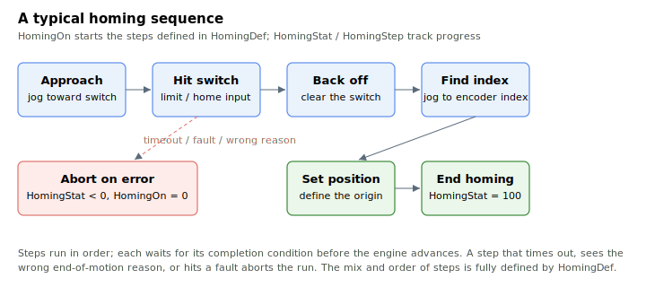

# Homing

The Agito controller has a built-in, programmable homing process that establishes a known reference position for the axis. The process is started by [HomingOn](HomingOn.md) and defined by [HomingDef](HomingDef.md); its status is reported by [HomingStat](HomingStat.md) and the current step by [HomingStep](HomingStep.md).

The homing process runs as an ordered sequence of steps. Up to 20 steps are supported. The number of steps, the instruction for each step, and that instruction's parameters are all defined by [HomingDef](HomingDef.md). A typical sequence approaches a switch, backs off, finds the encoder index, sets the position there, and ends.



Most homing steps include built-in error detection. When an error is detected during the process, the run is aborted, [HomingOn](HomingOn.md) is cleared, and [HomingStat](HomingStat.md) is set to a negative code that identifies the failure.

The category contains:

- **Run and status** — [HomingOn](HomingOn.md) (start/stop), [HomingDef](HomingDef.md) (the step definitions), [HomingStat](HomingStat.md) (per-step status and error codes) and [HomingStep](HomingStep.md) (the step reached).
- **Switch inputs** — [HomeStat](HomeStat.md) (the home input level), with [StopOnHome](StopOnHome.md) and [StopOnIndex](StopOnIndex.md) arming a jog to stop on a home-input change or on the encoder index.
- **Commutation at home** — [HomeComtAngOn](HomeComtAngOn.md), [HomeComtAngWr](HomeComtAngWr.md) and [HomeComtAngRd](HomeComtAngRd.md), which capture and re-establish the commutation angle at the index so a known mechanical home can restore the electrical angle.

**Note:** on entering the homing process the axis kinematics (speed, acceleration, deceleration and emergency deceleration) are temporarily saved and restored when the run completes, because a homing run may change them.

## Walk-through: run a 3-step home using limit + index

A common homing recipe is *jog into the reverse limit*, then *jog slowly to the encoder index*, then *zero the position there* and end. Each step occupies a 10-element block of [HomingDef](HomingDef.md): step 1 in `[1..10]`, step 2 in `[11..20]`, step 3 in `[21..30]`, etc. The first element of each block selects the step's instruction; the rest are that instruction's parameters.

1. **Define step 1** — jog into the reverse limit. Negative jog speed runs toward the reverse limit. The step completes when motion stops with the expected end-of-motion reason; a wrong reason aborts with [HomingStat](HomingStat.md) = `-4`, a timeout aborts with `-2`.

   ```text
   ; step 1 (block [1..10]) — jog into reverse limit
   AHomingDef[1]=1          ; instruction: jog into limit
   AHomingDef[2]=-50000     ; jog speed (sign sets direction)
   AHomingDef[3]=500000     ; accel/decel
   AHomingDef[4]=1000000    ; emergency decel
   AHomingDef[5]=200000     ; timeout [controller cycles]
   ```

2. **Define step 2** — jog slowly to the encoder index. Use a low speed so the index pulse is reliably detected. The step is a "jog to index" (instruction `4`); on completion the commutation angle at the index is captured into [HomeComtAngRd](HomeComtAngRd.md), and if [HomeComtAngOn](HomeComtAngOn.md) is enabled, [HomeComtAngWr](HomeComtAngWr.md) is loaded back into the commutation.

   ```text
   ; step 2 (block [11..20]) — jog to encoder index
   AHomingDef[11]=4         ; instruction: jog to index
   AHomingDef[12]=5000      ; jog speed (positive: away from the limit, slow)
   AHomingDef[13]=200000    ; accel/decel
   AHomingDef[14]=1000000   ; emergency decel
   AHomingDef[15]=200000    ; timeout
   ```

3. **Define step 3** — set the position to `0` at the index, and step 4 — end the run. The sequence **must** terminate with an "End homing" (instruction `0`); running past the last defined step without one aborts with `HomingStat` = `-7`.

   ```text
   ; step 3 (block [21..30]) — set position to 0 here
   AHomingDef[21]=6         ; instruction: set position
   AHomingDef[22]=0         ; new position value
   AHomingDef[23]=100       ; timeout
   ; step 4 (block [31..40]) — end homing
   AHomingDef[31]=0         ; instruction: end homing
   ```

4. **Start and poll.** [HomingOn](HomingOn.md) cannot be written while the axis is in motion. While the run is active, [HomingStat](HomingStat.md) and [HomingStep](HomingStep.md) both hold the current step number; on completion `HomingStat` switches to `100` and `HomingOn` is cleared automatically. On failure `HomingOn` is also cleared and `HomingStat` holds a negative error code (for example `-3` for unexpected motor-off, where the cause is in [ConFlt](../07-status-and-faults/ConFlt.md)):

   ```text
   AHomingOn=1              ; start; the axis must be stationary
   AHomingStat              ; current step while running, 100 = done, <0 = aborted
   AHomingStep              ; same step number while running; retains step on abort
   ```

The axis's normal kinematics (speed, accel, decel, emergency decel and jerk mode) are saved before step 1 and restored when `HomingOn` is cleared, so a homing run does not change them outside the run. Multi-axis homing can be synchronised through [UserParam](../20-arrays/UserParam.md) elements using `HomingDef` instructions `19` (set a UserParam element) and `20` (wait for a UserParam element to reach a value).
