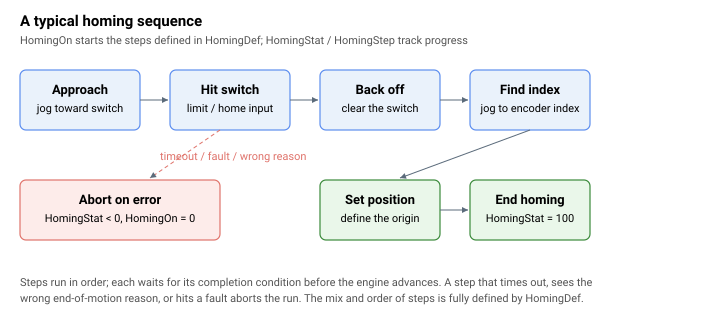

# 回零（原点回归）

Agito 控制器内置可编程的回零过程，用于为轴建立已知的参考位置。该过程由 [HomingOn](HomingOn.md) 启动，由 [HomingDef](HomingDef.md) 定义；其状态由 [HomingStat](HomingStat.md) 报告，当前步骤由 [HomingStep](HomingStep.md) 报告。

回零过程按有序步骤序列运行，最多支持 20 个步骤。步骤数量、每个步骤的指令及其参数均由 [HomingDef](HomingDef.md) 定义。典型序列包括：靠近限位开关、退出、找到编码器索引、在该位置设置位置，然后结束。



大多数回零步骤包含内置错误检测。当过程中检测到错误时，运行将中止，[HomingOn](HomingOn.md) 被清零，[HomingStat](HomingStat.md) 被设置为标识故障的负代码。

该分类包含：

- **运行与状态** — [HomingOn](HomingOn.md)（启动/停止）、[HomingDef](HomingDef.md)（步骤定义）、[HomingStat](HomingStat.md)（每步状态与错误代码）和 [HomingStep](HomingStep.md)（已到达的步骤）。
- **开关输入** — [HomeStat](HomeStat.md)（原点输入电平），以及 [StopOnHome](StopOnHome.md) 和 [StopOnIndex](StopOnIndex.md)，用于使能点动在原点输入变化或编码器索引处停止。
- **回零处的换相** — [HomeComtAngOn](HomeComtAngOn.md)、[HomeComtAngWr](HomeComtAngWr.md) 和 [HomeComtAngRd](HomeComtAngRd.md)，用于在索引处捕获并重新建立换相角，从而使已知机械原点能够恢复电角度。

**注意：** 进入回零过程时，轴的运动学参数（速度、加速度、减速度和紧急减速度）将被临时保存，并在运行完成后恢复，因为回零运行可能会更改这些参数。

## 操作示例：使用限位开关 + 索引运行 3 步回零

常用的回零方案是：*点动至反向限位*，然后*缓慢点动至编码器索引*，再*在该处将位置清零*并结束。每个步骤占用 [HomingDef](HomingDef.md) 中 10 个元素的块：步骤 1 在 `[1..10]`，步骤 2 在 `[11..20]`，步骤 3 在 `[21..30]`，依此类推。每块的第一个元素选择步骤指令，其余元素为该指令的参数。

1. **定义步骤 1** — 点动至反向限位。负点动速度朝反向限位运动。当运动以预期的运动结束原因停止时，该步骤完成；错误原因将以 [HomingStat](HomingStat.md) = `-4` 中止，超时将以 `-2` 中止。

   ```text
   ; step 1 (block [1..10]) — jog into reverse limit
   AHomingDef[1]=1          ; instruction: jog into limit
   AHomingDef[2]=-50000     ; jog speed (sign sets direction)
   AHomingDef[3]=500000     ; accel/decel
   AHomingDef[4]=1000000    ; emergency decel
   AHomingDef[5]=200000     ; timeout [controller cycles]
   ```

2. **定义步骤 2** — 缓慢点动至编码器索引。使用低速以确保可靠检测到索引脉冲。该步骤为"点动至索引"（指令 `4`）；完成后，索引处的换相角被捕获到 [HomeComtAngRd](HomeComtAngRd.md) 中，若 [HomeComtAngOn](HomeComtAngOn.md) 已使能，则 [HomeComtAngWr](HomeComtAngWr.md) 的值将被重新加载到换相中。

   ```text
   ; step 2 (block [11..20]) — jog to encoder index
   AHomingDef[11]=4         ; instruction: jog to index
   AHomingDef[12]=5000      ; jog speed (positive: away from the limit, slow)
   AHomingDef[13]=200000    ; accel/decel
   AHomingDef[14]=1000000   ; emergency decel
   AHomingDef[15]=200000    ; timeout
   ```

3. **定义步骤 3** — 在索引处将位置设为 `0`，以及步骤 4 — 结束运行。序列**必须**以"结束回零"（指令 `0`）终止；若在未设置该指令的情况下运行到最后一个已定义步骤之后，将以 `HomingStat` = `-7` 中止。

   ```text
   ; step 3 (block [21..30]) — set position to 0 here
   AHomingDef[21]=6         ; instruction: set position
   AHomingDef[22]=0         ; new position value
   AHomingDef[23]=100       ; timeout
   ; step 4 (block [31..40]) — end homing
   AHomingDef[31]=0         ; instruction: end homing
   ```

4. **启动并轮询。** [HomingOn](HomingOn.md) 在轴运动中不可写入。运行期间，[HomingStat](HomingStat.md) 和 [HomingStep](HomingStep.md) 均保持当前步骤编号；完成后 `HomingStat` 切换为 `100`，`HomingOn` 自动清零。失败时 `HomingOn` 同样被清零，`HomingStat` 保持负错误代码（例如 `-3` 表示电机意外关闭，原因在 [ConFlt](../07-status-and-faults/ConFlt.md) 中）：

   ```text
   AHomingOn=1              ; start; the axis must be stationary
   AHomingStat              ; current step while running, 100 = done, <0 = aborted
   AHomingStep              ; same step number while running; retains step on abort
   ```

轴的正常运动学参数（速度、加速度、减速度、紧急减速度和加加速度模式）在步骤 1 前保存，并在 `HomingOn` 清零时恢复，因此回零运行不会在运行结束后改变这些参数。多轴回零可通过 [UserParam](../20-arrays/UserParam.md) 元素与 `HomingDef` 指令 `19`（设置 UserParam 元素）和 `20`（等待 UserParam 元素达到某值）同步。
