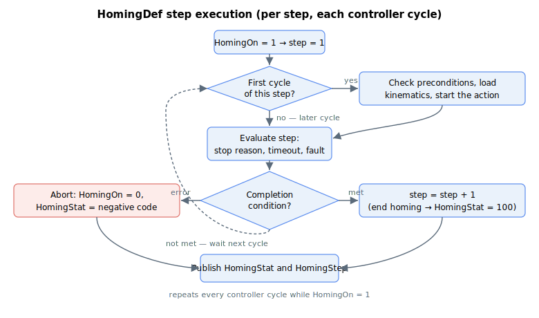

# HomingDef

Array defining up to 20 homing steps, each an instruction plus its parameters.

## Overview

`HomingDef` defines the built-in homing process: up to 20 steps, each consisting of one instruction plus the parameters for that instruction. Each step occupies a block of 10 consecutive array elements. Within a step's block the first element is the instruction; the remaining nine elements are that instruction's parameters. So `HomingDef[1–10]` configures step 1, `HomingDef[11–20]` configures step 2, and so on up to `HomingDef[191–200]` for step 20. The array is 1-indexed; element `[0]` does not exist.

`HomingDef` is read and executed when [HomingOn](HomingOn.md) is set to `1`; progress and any error are reported by [HomingStat](HomingStat.md) and [HomingStep](HomingStep.md). It is an axis-scoped array saved to flash. The homing process must terminate with an "End homing" instruction (`0`); running past the last defined step without one aborts with a "too many steps" error ([HomingStat](HomingStat.md) = `-7`).

## How it works

Steps run strictly in order, one per "first cycle" then evaluated each controller cycle until the step's completion condition is met, at which point the engine advances to the next step. Motion steps (jog/PTP) start a move, then wait for it to stop for the expected [MotionReason](../10-motion/05-motion-status/MotionReason.md); the wrong end-of-motion reason aborts with [HomingStat](HomingStat.md) = `-4`. Every motion step also has a timeout parameter (in controller cycles); exceeding it aborts with `-2`. For the duration of a homing run the engine overrides the axis kinematics with each step's parameters and forces jerk mode off, restoring the original values when homing ends (see [HomingOn](HomingOn.md)).



The instruction stored in the first element of each step (`HomingDef[1, 11, …, 191]`) selects what that step does:

| Value | Instruction |
|---|---|
| 0 | End homing |
| 1 | Jog into limit |
| 2 | Check that axis is out of limits |
| 3 | Relative point-to-point (PTP) motion |
| 4 | Jog to index |
| 5 | Move to index position |
| 6 | Set position |
| 7 | Wait N controller cycles |
| 8 | Enable (or disable) the motor |
| 9 | Move to hard stop (detected by motor stuck) |
| 10 | Move to hard stop (detected by high position error) |
| 11 | Jog until a change in the Home discrete input |
| 12 | Absolute point-to-point (PTP) motion |
| 13 | Set software position limits (RevPLim and FwdPLim) |
| 14 | Configure Lock (position-capture) |
| 15 | Jog to Lock event |
| 16 | Move to Lock position |
| 17 | Write to MotionMode |
| 18 | Write to MapType |
| 19 | Set a UserParam element |
| 20 | Wait for a UserParam element to reach a value |

The remaining elements of each step (`HomingDef[2, 12, …, 192]`, `HomingDef[3, 13, …, 193]`, etc.) hold the parameters for the step's instruction. The following tables detail those parameters. In each table the index list shows the element position within the step block; for step 1 use the first number, for step 2 add 10, and so on.

| HomingDef[Index] | Value descriptions |
|---|---|
| HomingDef[1, 11, …, 191] = 0 | End homing. This must be the last executed step. Reaching it means homing completed successfully ([HomingStat](HomingStat.md) = `100`). |

| HomingDef[Index] | Value descriptions |
|---|---|
| HomingDef[1, 11, …, 191] = 1 | Jog into limit. Jog with the kinematics below; completes when the motion stops on the limit switch in the direction of travel. |
| HomingDef[2, 12, …, 192] | Jog speed (sign is the direction, and selects which limit — forward or reverse — to look for). |
| HomingDef[3, 13, …, 193] | Jog acceleration/deceleration. |
| HomingDef[4, 14, …, 194] | Jog emergency deceleration. |
| HomingDef[5, 15, …, 195] | Timeout [controller cycles]. |

| HomingDef[Index] | Value descriptions |
|---|---|
| HomingDef[1, 11, …, 191] = 2 | Check that axis is out of limits. Reads the limit-switch status ([LimitsStat](../06-protections/03-motion/position-limit-protection/LimitsStat.md)); if either RLS or FLS is active the homing aborts with [HomingStat](HomingStat.md) = `-8`, otherwise it advances. No motion. |

| HomingDef[Index] | Value descriptions |
|---|---|
| HomingDef[1, 11, …, 191] = 3 | Relative PTP motion. Move with the kinematics below by a given relative distance. |
| HomingDef[2, 12, …, 192] | Maximum speed. |
| HomingDef[3, 13, …, 193] | Maximum acceleration/deceleration. |
| HomingDef[4, 14, …, 194] | Relative distance (positive or negative). |
| HomingDef[5, 15, …, 195] | Timeout [controller cycles]. |

| HomingDef[Index] | Value descriptions |
|---|---|
| HomingDef[1, 11, …, 191] = 4 | Jog to index. Jog with the kinematics below until the encoder index is detected, then stop (uses [StopOnIndex](StopOnIndex.md) internally). The jog speed should be low enough to ensure the index is reliably detected. |
| HomingDef[2, 12, …, 192] | Jog speed (sign is the direction). |
| HomingDef[3, 13, …, 193] | Jog acceleration/deceleration. |
| HomingDef[4, 14, …, 194] | Jog emergency deceleration. |
| HomingDef[5, 15, …, 195] | Timeout [controller cycles]. |

| HomingDef[Index] | Value descriptions |
|---|---|
| HomingDef[1, 11, …, 191] = 5 | Move to index position. PTP move to the last recorded index position ([IndexPos](../03-encoder/02-index-detection/IndexPos-AuxIndexPos.md)). On completion the commutation angle at the index is captured into [HomeComtAngRd](HomeComtAngRd.md), and if [HomeComtAngOn](HomeComtAngOn.md) is enabled the commutation is set from [HomeComtAngWr](HomeComtAngWr.md). |
| HomingDef[2, 12, …, 192] | Maximum speed. |
| HomingDef[3, 13, …, 193] | Maximum acceleration/deceleration. |
| HomingDef[4, 14, …, 194] | Emergency deceleration. |
| HomingDef[5, 15, …, 195] | Timeout [controller cycles]. |

| HomingDef[Index] | Value descriptions |
|---|---|
| HomingDef[1, 11, …, 191] = 6 | Set position. Set the current position to the given value. **Note:** aborts with [HomingStat](HomingStat.md) = `-9` if the conditions for [SetPosition](../10-motion/03-kinematics-configuration/SetPosition.md) are not met. |
| HomingDef[2, 12, …, 192] | New position value to set at the current position. |
| HomingDef[3, 13, …, 193] | Timeout [controller cycles]. |

| HomingDef[Index] | Value descriptions |
|---|---|
| HomingDef[1, 11, …, 191] = 7 | Wait N controller cycles. |
| HomingDef[2, 12, …, 192] | Number of controller cycles to wait before advancing to the next step. |

| HomingDef[Index] | Value descriptions |
|---|---|
| HomingDef[1, 11, …, 191] = 8 | Enable (or disable) the motor. **Note:** enabling requires that phasing (commutation initialization) is already done, otherwise the homing aborts with [HomingStat](HomingStat.md) = `-12`. |
| HomingDef[2, 12, …, 192] | 0 to disable ([MotorOn](../08-axis-operation/01-general-keywords/MotorOn.md) = 0), 1 to enable (MotorOn = 1). |
| HomingDef[3, 13, …, 193] | Timeout [controller cycles]. |

| HomingDef[Index] | Value descriptions |
|---|---|
| HomingDef[1, 11, …, 191] = 9 | Move to hard stop (detected by motor stuck). Jog with the kinematics below until the motor is judged stuck: absolute velocity below the velocity threshold and absolute current at or above the current threshold, held continuously for the stuck time. The motion is then aborted and the position set to the given value. The sign of the maximum-speed parameter sets the direction. **Note:** aborts with [HomingStat](HomingStat.md) = `-9` if the conditions for [SetPosition](../10-motion/03-kinematics-configuration/SetPosition.md) are not met. |
| HomingDef[2, 12, …, 192] | Maximum speed (sign sets direction). |
| HomingDef[3, 13, …, 193] | Maximum acceleration/deceleration. |
| HomingDef[4, 14, …, 194] | Emergency deceleration. |
| HomingDef[5, 15, …, 195] | Velocity threshold for "stuck". |
| HomingDef[6, 16, …, 196] | Motor current threshold for "stuck" [mA]. |
| HomingDef[7, 17, …, 197] | Stuck time [controller cycles]. |
| HomingDef[8, 18, …, 198] | New position value to set at the hard stop. |
| HomingDef[9, 19, …, 199] | Timeout [controller cycles]. |

| HomingDef[Index] | Value descriptions |
|---|---|
| HomingDef[1, 11, …, 191] = 10 | Move to hard stop (detected by high position error). Jog with the kinematics below until the absolute position error exceeds the given threshold, then abort the motion and set the position to the given value. The sign of the maximum-speed parameter sets the direction. **Note:** aborts with [HomingStat](HomingStat.md) = `-9` if the conditions for [SetPosition](../10-motion/03-kinematics-configuration/SetPosition.md) are not met. |
| HomingDef[2, 12, …, 192] | Maximum speed (sign sets direction). |
| HomingDef[3, 13, …, 193] | Maximum acceleration/deceleration. |
| HomingDef[4, 14, …, 194] | Emergency deceleration. |
| HomingDef[5, 15, …, 195] | Maximum position error threshold. |
| HomingDef[6, 16, …, 196] | New position value to set at the hard stop. |
| HomingDef[7, 17, …, 197] | Timeout [controller cycles]. |

| HomingDef[Index] | Value descriptions |
|---|---|
| HomingDef[1, 11, …, 191] = 11 | Jog until a change in the Home discrete input. Jog with the kinematics below until the Home input changes state (uses [StopOnHome](StopOnHome.md) internally). The initial direction depends on the current [HomeStat](HomeStat.md): if Home is `0`, the sign of the maximum-speed parameter is used as-is; if Home is `1`, the direction is inverted so the axis moves off the flag. If no input is assigned the Home function, the move continues until timeout or end of travel. |
| HomingDef[2, 12, …, 192] | Maximum speed (sign sets direction when Home = 0). |
| HomingDef[3, 13, …, 193] | Maximum acceleration/deceleration. |
| HomingDef[4, 14, …, 194] | Emergency deceleration. |
| HomingDef[5, 15, …, 195] | Timeout [controller cycles]. |

| HomingDef[Index] | Value descriptions |
|---|---|
| HomingDef[1, 11, …, 191] = 12 | Absolute PTP motion. Move with the kinematics below to a given absolute target position. |
| HomingDef[2, 12, …, 192] | Maximum speed. |
| HomingDef[3, 13, …, 193] | Maximum acceleration/deceleration. |
| HomingDef[4, 14, …, 194] | Absolute target position. |
| HomingDef[5, 15, …, 195] | Timeout [controller cycles]. |

| HomingDef[Index] | Value descriptions |
|---|---|
| HomingDef[1, 11, …, 191] = 13 | Set software position limits. Optionally sets the reverse ([RevPLim](../06-protections/03-motion/position-limit-protection/RevPLim.md)) and/or forward ([FwdPLim](../06-protections/03-motion/position-limit-protection/FwdPLim.md)) software limits. No motion. |
| HomingDef[2, 12, …, 192] | 1 to set RevPLim, 0 to leave it unchanged. |
| HomingDef[3, 13, …, 193] | New value of RevPLim. |
| HomingDef[4, 14, …, 194] | 1 to set FwdPLim, 0 to leave it unchanged. |
| HomingDef[5, 15, …, 195] | New value of FwdPLim. |

| HomingDef[Index] | Value descriptions |
|---|---|
| HomingDef[1, 11, …, 191] = 14 | Configure Lock (position capture). Applies the given Lock enable and Lock source/polarity settings and waits for the controller to (re)configure the capture hardware. No motion. Used together with instructions 15 and 16 to home against a captured event. |
| HomingDef[2, 12, …, 192] | Lock enable/disable. |
| HomingDef[3, 13, …, 193] | Lock source (and polarity). |
| HomingDef[4, 14, …, 194] | Timeout [controller cycles]. |

| HomingDef[Index] | Value descriptions |
|---|---|
| HomingDef[1, 11, …, 191] = 15 | Jog to Lock event. Jog with the kinematics below until a Lock (position capture) event occurs, then stop. Requires a prior "Configure Lock" step. |
| HomingDef[2, 12, …, 192] | Jog speed (sign sets direction). |
| HomingDef[3, 13, …, 193] | Acceleration/deceleration. |
| HomingDef[4, 14, …, 194] | Emergency deceleration. |
| HomingDef[5, 15, …, 195] | Timeout [controller cycles]. |

| HomingDef[Index] | Value descriptions |
|---|---|
| HomingDef[1, 11, …, 191] = 16 | Move to Lock position. PTP move to the captured Lock position. As with the index step, the commutation angle there is captured into [HomeComtAngRd](HomeComtAngRd.md), and if [HomeComtAngOn](HomeComtAngOn.md) is enabled the commutation is set from [HomeComtAngWr](HomeComtAngWr.md). |
| HomingDef[2, 12, …, 192] | Maximum speed. |
| HomingDef[3, 13, …, 193] | Maximum acceleration/deceleration. |
| HomingDef[4, 14, …, 194] | Emergency deceleration. |
| HomingDef[5, 15, …, 195] | Timeout [controller cycles]. |

| HomingDef[Index] | Value descriptions |
|---|---|
| HomingDef[1, 11, …, 191] = 17 | Write to MotionMode. Sets [MotionMode](../10-motion/02-motion-configuration/MotionMode.md) to the given value. Aborts with [HomingStat](HomingStat.md) = `-10` if the value is out of range or a gearing mode (not allowed here). No motion is started. |
| HomingDef[2, 12, …, 192] | New value for MotionMode. |

| HomingDef[Index] | Value descriptions |
|---|---|
| HomingDef[1, 11, …, 191] = 18 | Write to MapType. Sets the encoder-mapping type. Aborts with [HomingStat](HomingStat.md) = `-11` if the value is out of the allowed range. No motion. |
| HomingDef[2, 12, …, 192] | New value for MapType. |

| HomingDef[Index] | Value descriptions |
|---|---|
| HomingDef[1, 11, …, 191] = 19 | Set a UserParam element. Writes a value into a chosen axis's UserParam array. No motion. |
| HomingDef[2, 12, …, 192] | Target axis. |
| HomingDef[3, 13, …, 193] | UserParam index to write. |
| HomingDef[4, 14, …, 194] | Value to write. |

| HomingDef[Index] | Value descriptions |
|---|---|
| HomingDef[1, 11, …, 191] = 20 | Wait for a UserParam element to reach a value. Advances when the chosen axis's UserParam element equals the target value; aborts on timeout. Useful for coordinating multi-axis homing. No motion. |
| HomingDef[2, 12, …, 192] | Target axis. |
| HomingDef[3, 13, …, 193] | UserParam index to watch. |
| HomingDef[4, 14, …, 194] | Value to wait for. |
| HomingDef[5, 15, …, 195] | Timeout [controller cycles]. |

## Examples

A three-step sequence — jog into the reverse limit, set position there to 0, then end:

```text
; --- step 1 (indices 1-10): jog into the reverse limit ---
AHomingDef[1]=1       ; instruction: jog into limit
AHomingDef[2]=-50000  ; jog speed (negative = toward the reverse limit)
AHomingDef[3]=500000  ; acceleration/deceleration
AHomingDef[4]=1000000 ; emergency deceleration
AHomingDef[5]=200000  ; timeout [controller cycles]
; --- step 2 (indices 11-20): set position to 0 here ---
AHomingDef[11]=6      ; instruction: set position
AHomingDef[12]=0      ; new position value
AHomingDef[13]=100    ; timeout [controller cycles]
; --- step 3 (indices 21-30): end homing ---
AHomingDef[21]=0      ; instruction: end homing
; --- run it ---
AHomingOn=1           ; start; watch AHomingStat for 100 (done) or a negative error
AHomingDef[1]        ; read back the instruction of step 1
```

## See also

- [HomingOn](HomingOn.md) — starts the process defined by this array
- [HomingStat](HomingStat.md) — reports progress and abort reasons for these steps
- [HomingStep](HomingStep.md) — the current homing step number
- [SetPosition](../10-motion/03-kinematics-configuration/SetPosition.md) — referenced by the "set position" and hard-stop steps
- [MotionReason](../10-motion/05-motion-status/MotionReason.md) — the end-of-motion reasons motion steps wait for
- [RevPLim](../06-protections/03-motion/position-limit-protection/RevPLim.md) / [FwdPLim](../06-protections/03-motion/position-limit-protection/FwdPLim.md) — software limits set by instruction 13
