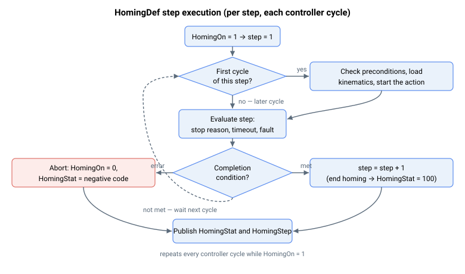

# HomingDef

数组，定义最多 20 个回零步骤，每个步骤包含一条指令及其参数。

## 概述

`HomingDef` 定义内置回零过程：最多 20 个步骤，每个步骤由一条指令及该指令的参数组成。每个步骤占用 10 个连续数组元素。步骤块中的第一个元素为指令，其余九个元素为该指令的参数。因此 `HomingDef[1–10]` 配置步骤 1，`HomingDef[11–20]` 配置步骤 2，依此类推，直至 `HomingDef[191–200]` 配置步骤 20。数组为 1-indexed；元素 `[0]` 不存在。

当 [HomingOn](HomingOn.md) 设为 `1` 时，`HomingDef` 被读取并执行；进度和任何错误由 [HomingStat](HomingStat.md) 和 [HomingStep](HomingStep.md) 报告。该参数为轴相关数组，保存至闪存。回零过程必须以"结束回零"指令（`0`）终止；若在最后一个已定义步骤结束前未遇到该指令，则以"步骤过多"错误中止（[HomingStat](HomingStat.md) = `-7`）。

## 工作原理

步骤严格按顺序执行：在"首次周期"执行一次，之后每个控制器周期评估一次，直至步骤的完成条件满足，随即引擎推进至下一步骤。运动步骤（点动/PTP）启动运动后等待其停止，并检查期望的 [MotionReason](../10-motion/05-motion-status/MotionReason.md)；若运动结束原因不符则以 [HomingStat](HomingStat.md) = `-4` 中止。每个运动步骤还有一个超时参数（以控制器周期计）；超时则以 `-2` 中止。回零运行期间，引擎使用各步骤参数覆盖轴的运动学参数并强制关闭加加速度模式，回零结束后恢复原始值（参见 [HomingOn](HomingOn.md)）。

超时和等待计数以控制器周期为单位。步骤在首次周期将其计数器归零，此后每个周期递增；当计数器超过参数值时中止（对等待步骤则推进）。在首次周期即完成的步骤不会超时。由于比较为严格大于，"等待 N 个控制器周期"步骤（指令 `7`）在计数器首次超过 N 时推进，即计数器达到 N 后的下一个周期。

"设置位置"步骤（指令 `6`）和两个"运动至机械硬限位"步骤（指令 `9` 和 `10`）通过后台请求而非内联方式完成实际位置变更：在首次周期，步骤发出设置位置请求并启动超时计数器；随后各周期中，一旦请求已被执行（引擎检测到请求标志已清除）则推进至下一步骤，若超时先到则以 [HomingStat](HomingStat.md) = `-2` 中止。工作推迟至后台循环，因为需要时间进行平滑重新初始化。



每个步骤的第一个元素中存储的指令（`HomingDef[1, 11, …, 191]`）决定该步骤的行为：

| 值 | 指令 |
|---|---|
| 0 | 结束回零 |
| 1 | 点动至限位 |
| 2 | 检查轴是否已离开限位 |
| 3 | 相对点到点（PTP）运动 |
| 4 | 点动至索引 |
| 5 | 运动至索引位置 |
| 6 | 设置位置 |
| 7 | 等待 N 个控制器周期 |
| 8 | 使能（或禁用）电机 |
| 9 | 运动至机械硬限位（由电机堵转检测） |
| 10 | 运动至机械硬限位（由高位置误差检测） |
| 11 | 点动直至原点数字量输入发生变化 |
| 12 | 绝对点到点（PTP）运动 |
| 13 | 设置软件位置限位（RevPLim 和 FwdPLim） |
| 14 | 配置 Lock（位置捕获） |
| 15 | 点动至 Lock 事件 |
| 16 | 运动至 Lock 位置 |
| 17 | 写入 MotionMode |
| 18 | 写入 MapType |
| 19 | 设置 UserParam 元素 |
| 20 | 等待 UserParam 元素达到某值 |

每个步骤的其余元素（`HomingDef[2, 12, …, 192]`、`HomingDef[3, 13, …, 193]` 等）保存该步骤指令的参数。以下各表详细说明这些参数。每张表中的索引列表显示步骤块内的元素位置；步骤 1 使用第一个编号，步骤 2 加 10，依此类推。

| HomingDef[索引] | 值说明 |
|---|---|
| HomingDef[1, 11, …, 191] = 0 | 结束回零。必须为最后一个执行的步骤。到达此步骤表示回零成功完成（[HomingStat](HomingStat.md) = `100`）。 |

| HomingDef[索引] | 值说明 |
|---|---|
| HomingDef[1, 11, …, 191] = 1 | 点动至限位。以下方运动学参数点动；仅当运动停在行进方向的限位开关时完成——正向速度须停在 FLS，反向速度须停在 RLS。任何其他运动结束原因（包括停在反向限位）均以 [HomingStat](HomingStat.md) = `-4` 中止。 |
| HomingDef[2, 12, …, 192] | 点动速度（符号为方向，并决定寻找哪个限位——正向或反向）。 |
| HomingDef[3, 13, …, 193] | 点动加速度/减速度。 |
| HomingDef[4, 14, …, 194] | 点动紧急减速度。 |
| HomingDef[5, 15, …, 195] | 超时【控制器周期】。 |

| HomingDef[索引] | 值说明 |
|---|---|
| HomingDef[1, 11, …, 191] = 2 | 检查轴是否已离开限位。读取限位开关状态（[LimitsStat](../06-protections/03-motion/position-limit-protection/LimitsStat.md)）；若 RLS 或 FLS 任一有效则以 [HomingStat](HomingStat.md) = `-8` 中止，否则推进。无运动。 |

| HomingDef[索引] | 值说明 |
|---|---|
| HomingDef[1, 11, …, 191] = 3 | 相对 PTP 运动。以下方运动学参数按给定相对距离运动。 |
| HomingDef[2, 12, …, 192] | 最大速度。 |
| HomingDef[3, 13, …, 193] | 最大加速度/减速度。 |
| HomingDef[4, 14, …, 194] | 相对距离（正或负）。 |
| HomingDef[5, 15, …, 195] | 超时【控制器周期】。 |

| HomingDef[索引] | 值说明 |
|---|---|
| HomingDef[1, 11, …, 191] = 4 | 点动至索引。以下方运动学参数点动，直至检测到编码器索引后停止（内部使用 [StopOnIndex](StopOnIndex.md)）。点动速度应足够低，以确保索引能被可靠检测。 |
| HomingDef[2, 12, …, 192] | 点动速度（符号为方向）。 |
| HomingDef[3, 13, …, 193] | 点动加速度/减速度。 |
| HomingDef[4, 14, …, 194] | 点动紧急减速度。 |
| HomingDef[5, 15, …, 195] | 超时【控制器周期】。 |

| HomingDef[索引] | 值说明 |
|---|---|
| HomingDef[1, 11, …, 191] = 5 | 运动至索引位置。PTP 运动至最后记录的索引位置（[IndexPos](../03-encoder/02-index-detection/IndexPos-AuxIndexPos.md)）。完成后，索引处的换相角被捕获至 [HomeComtAngRd](HomeComtAngRd.md)，若 [HomeComtAngOn](HomeComtAngOn.md) 已使能，则从 [HomeComtAngWr](HomeComtAngWr.md) 设置换相。 |
| HomingDef[2, 12, …, 192] | 最大速度。 |
| HomingDef[3, 13, …, 193] | 最大加速度/减速度。 |
| HomingDef[4, 14, …, 194] | 紧急减速度。 |
| HomingDef[5, 15, …, 195] | 超时【控制器周期】。 |

| HomingDef[索引] | 值说明 |
|---|---|
| HomingDef[1, 11, …, 191] = 6 | 设置位置。将当前位置设为给定值。**注意：** 若 [SetPosition](../10-motion/03-kinematics-configuration/SetPosition.md) 的条件不满足，则以 [HomingStat](HomingStat.md) = `-9` 中止。 |
| HomingDef[2, 12, …, 192] | 在当前位置设置的新位置值。 |
| HomingDef[3, 13, …, 193] | 超时【控制器周期】。 |

| HomingDef[索引] | 值说明 |
|---|---|
| HomingDef[1, 11, …, 191] = 7 | 等待 N 个控制器周期。 |
| HomingDef[2, 12, …, 192] | 推进至下一步骤前等待的控制器周期数。 |

| HomingDef[索引] | 值说明 |
|---|---|
| HomingDef[1, 11, …, 191] = 8 | 使能（或禁用）电机。**注意：** 无论请求为使能还是禁用，相位初始化（换相初始化）必须在本步骤运行前已完成——若 [ComtStatus](../15-commutation/ComtStatus.md)`[1]` 仍为 `0`（尚未完成）或 `1`（进行中），则以 [HomingStat](HomingStat.md) = `-12` 中止。若步骤开始时轴处于运动中也会中止（[HomingStat](HomingStat.md) = `-6`）。 |
| HomingDef[2, 12, …, 192] | 0 为禁用（[MotorOn](../08-axis-operation/01-general-keywords/MotorOn.md) = 0），1 为使能（MotorOn = 1）。 |
| HomingDef[3, 13, …, 193] | 超时【控制器周期】。 |

| HomingDef[索引] | 值说明 |
|---|---|
| HomingDef[1, 11, …, 191] = 9 | 运动至机械硬限位（由电机堵转检测）。以下方运动学参数点动，直至判定电机堵转：绝对速度低于速度阈值且绝对电流达到或超过电流阈值，持续满足堵转时间。随即立即在硬限位处结束运动（无减速斜坡——不同于限位/索引/原点停止），并通过后台请求将位置设为给定值。最大速度参数的符号决定方向。**注意：** 若 [SetPosition](../10-motion/03-kinematics-configuration/SetPosition.md) 的条件不满足，则以 [HomingStat](HomingStat.md) = `-9` 中止。 |
| HomingDef[2, 12, …, 192] | 最大速度（符号决定方向）。 |
| HomingDef[3, 13, …, 193] | 最大加速度/减速度。 |
| HomingDef[4, 14, …, 194] | 紧急减速度。 |
| HomingDef[5, 15, …, 195] | "堵转"速度阈值。 |
| HomingDef[6, 16, …, 196] | "堵转"电机电流阈值【mA】。 |
| HomingDef[7, 17, …, 197] | 堵转时间【控制器周期】。 |
| HomingDef[8, 18, …, 198] | 在机械硬限位处设置的新位置值。 |
| HomingDef[9, 19, …, 199] | 超时【控制器周期】。 |

| HomingDef[索引] | 值说明 |
|---|---|
| HomingDef[1, 11, …, 191] = 10 | 运动至机械硬限位（由高位置误差检测）。以下方运动学参数点动，直至绝对位置误差超过给定阈值，随即立即在硬限位处结束运动（无减速斜坡——不同于限位/索引/原点停止），并通过后台请求将位置设为给定值。最大速度参数的符号决定方向。**注意：** 若 [SetPosition](../10-motion/03-kinematics-configuration/SetPosition.md) 的条件不满足，则以 [HomingStat](HomingStat.md) = `-9` 中止。 |
| HomingDef[2, 12, …, 192] | 最大速度（符号决定方向）。 |
| HomingDef[3, 13, …, 193] | 最大加速度/减速度。 |
| HomingDef[4, 14, …, 194] | 紧急减速度。 |
| HomingDef[5, 15, …, 195] | 最大位置误差阈值。 |
| HomingDef[6, 16, …, 196] | 在机械硬限位处设置的新位置值。 |
| HomingDef[7, 17, …, 197] | 超时【控制器周期】。 |

| HomingDef[索引] | 值说明 |
|---|---|
| HomingDef[1, 11, …, 191] = 11 | 点动直至原点数字量输入发生变化。以下方运动学参数点动，直至 Home 输入状态改变（内部使用 [StopOnHome](StopOnHome.md)）。初始方向取决于当前 [HomeStat](HomeStat.md)：若 Home 为 `0`，则按最大速度参数的符号方向运动；若 Home 为 `1`，则方向取反，使轴离开标志。若无输入被分配 Home 功能，则运动持续至超时或行程终点。 |
| HomingDef[2, 12, …, 192] | 最大速度（Home = 0 时符号决定方向）。 |
| HomingDef[3, 13, …, 193] | 最大加速度/减速度。 |
| HomingDef[4, 14, …, 194] | 紧急减速度。 |
| HomingDef[5, 15, …, 195] | 超时【控制器周期】。 |

| HomingDef[索引] | 值说明 |
|---|---|
| HomingDef[1, 11, …, 191] = 12 | 绝对 PTP 运动。以下方运动学参数运动至给定绝对目标位置。 |
| HomingDef[2, 12, …, 192] | 最大速度。 |
| HomingDef[3, 13, …, 193] | 最大加速度/减速度。 |
| HomingDef[4, 14, …, 194] | 绝对目标位置。 |
| HomingDef[5, 15, …, 195] | 超时【控制器周期】。 |

| HomingDef[索引] | 值说明 |
|---|---|
| HomingDef[1, 11, …, 191] = 13 | 设置软件位置限位。可选择性设置反向（[RevPLim](../06-protections/03-motion/position-limit-protection/RevPLim.md)）和/或正向（[FwdPLim](../06-protections/03-motion/position-limit-protection/FwdPLim.md)）软件限位。无运动。 |
| HomingDef[2, 12, …, 192] | 1 为设置 RevPLim，0 为保持不变。 |
| HomingDef[3, 13, …, 193] | RevPLim 的新值。 |
| HomingDef[4, 14, …, 194] | 1 为设置 FwdPLim，0 为保持不变。 |
| HomingDef[5, 15, …, 195] | FwdPLim 的新值。 |

| HomingDef[索引] | 值说明 |
|---|---|
| HomingDef[1, 11, …, 191] = 14 | 配置 Lock（位置捕获）。应用给定的 Lock 使能及 Lock 源/极性设置，并等待控制器（重新）配置捕获硬件。无运动。与指令 15 和 16 配合使用，对捕获事件进行回零。 |
| HomingDef[2, 12, …, 192] | Lock 使能/禁用。 |
| HomingDef[3, 13, …, 193] | Lock 源（及极性）。 |
| HomingDef[4, 14, …, 194] | 超时【控制器周期】。 |

| HomingDef[索引] | 值说明 |
|---|---|
| HomingDef[1, 11, …, 191] = 15 | 点动至 Lock 事件。以下方运动学参数点动，直至发生 Lock（位置捕获）事件后停止。需要在此之前执行"配置 Lock"步骤。 |
| HomingDef[2, 12, …, 192] | 点动速度（符号决定方向）。 |
| HomingDef[3, 13, …, 193] | 加速度/减速度。 |
| HomingDef[4, 14, …, 194] | 紧急减速度。 |
| HomingDef[5, 15, …, 195] | 超时【控制器周期】。 |

| HomingDef[索引] | 值说明 |
|---|---|
| HomingDef[1, 11, …, 191] = 16 | 运动至 Lock 位置。PTP 运动至捕获的 Lock 位置。与索引步骤相同，该处的换相角被捕获至 [HomeComtAngRd](HomeComtAngRd.md)，若 [HomeComtAngOn](HomeComtAngOn.md) 已使能则从 [HomeComtAngWr](HomeComtAngWr.md) 设置换相。 |
| HomingDef[2, 12, …, 192] | 最大速度。 |
| HomingDef[3, 13, …, 193] | 最大加速度/减速度。 |
| HomingDef[4, 14, …, 194] | 紧急减速度。 |
| HomingDef[5, 15, …, 195] | 超时【控制器周期】。 |

| HomingDef[索引] | 值说明 |
|---|---|
| HomingDef[1, 11, …, 191] = 17 | 写入 MotionMode。将 [MotionMode](../10-motion/02-motion-configuration/MotionMode.md) 设为给定值。若值超出范围或为齿轮模式（此处不允许）则以 [HomingStat](HomingStat.md) = `-10` 中止。不启动运动。 |
| HomingDef[2, 12, …, 192] | MotionMode 的新值。 |

| HomingDef[索引] | 值说明 |
|---|---|
| HomingDef[1, 11, …, 191] = 18 | 写入 MapType。设置编码器映射类型。若值超出允许范围则以 [HomingStat](HomingStat.md) = `-11` 中止。无运动。 |
| HomingDef[2, 12, …, 192] | MapType 的新值。 |

| HomingDef[索引] | 值说明 |
|---|---|
| HomingDef[1, 11, …, 191] = 19 | 设置 UserParam 元素。将值写入指定轴的 UserParam 数组。无运动。 |
| HomingDef[2, 12, …, 192] | 目标轴。 |
| HomingDef[3, 13, …, 193] | 要写入的 UserParam 索引。 |
| HomingDef[4, 14, …, 194] | 要写入的值。 |

| HomingDef[索引] | 值说明 |
|---|---|
| HomingDef[1, 11, …, 191] = 20 | 等待 UserParam 元素达到某值。当指定轴的 UserParam 元素等于目标值时推进；超时则中止。适用于协调多轴回零。无运动。 |
| HomingDef[2, 12, …, 192] | 目标轴。 |
| HomingDef[3, 13, …, 193] | 要监视的 UserParam 索引。 |
| HomingDef[4, 14, …, 194] | 等待的目标值。 |
| HomingDef[5, 15, …, 195] | 超时【控制器周期】。 |

## 示例

三步序列——点动至反向限位，在该处将位置设为 0，然后结束：

```text
; --- 步骤 1（索引 1-10）：点动至反向限位 ---
AHomingDef[1]=1       ; 指令：点动至限位
AHomingDef[2]=-50000  ; 点动速度（负值 = 朝反向限位）
AHomingDef[3]=500000  ; 加速度/减速度
AHomingDef[4]=1000000 ; 紧急减速度
AHomingDef[5]=200000  ; 超时【控制器周期】
; --- 步骤 2（索引 11-20）：在此处将位置设为 0 ---
AHomingDef[11]=6      ; 指令：设置位置
AHomingDef[12]=0      ; 新位置值
AHomingDef[13]=100    ; 超时【控制器周期】
; --- 步骤 3（索引 21-30）：结束回零 ---
AHomingDef[21]=0      ; 指令：结束回零
; --- 执行 ---
AHomingOn=1           ; 启动；监视 AHomingStat，100 为完成，负值为错误
AHomingDef[1]        ; 读回步骤 1 的指令
```

## 另请参阅

- [HomingOn](HomingOn.md) — 启动本数组定义的回零过程
- [HomingStat](HomingStat.md) — 报告各步骤的进度及中止原因
- [HomingStep](HomingStep.md) — 当前回零步骤编号
- [SetPosition](../10-motion/03-kinematics-configuration/SetPosition.md) — 被"设置位置"和机械硬限位步骤引用
- [MotionReason](../10-motion/05-motion-status/MotionReason.md) — 运动步骤等待的运动结束原因
- [RevPLim](../06-protections/03-motion/position-limit-protection/RevPLim.md) / [FwdPLim](../06-protections/03-motion/position-limit-protection/FwdPLim.md) — 指令 13 设置的软件限位
