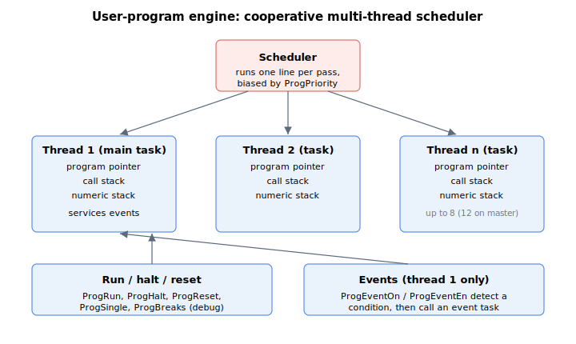

# Program execution

This section covers the keywords that load, run, stop, debug and instrument a user program. A user program runs as one or more independent **threads** under a built-in cooperative scheduler — up to 8 threads on a standalone controller and up to 12 on a Central-i master. Each thread executes a **task** (the code after a [ProgTask](ProgTask.md) label; task 1 is the main program) and keeps its own program pointer, call stack and numeric stack, so several tasks can run side by side. The scheduler advances each active thread by one line per pass, biased by [ProgPriority](ProgPriority.md).



The keywords below fall into a few groups: loading and removing a program; running, pausing and resetting threads; calling functions and passing arguments; debugging with breakpoints, single-step and snapshots; defining and servicing events; and streaming status to a host.

The following table summarizes the program-execution keywords.

| No. | Keyword | Summary |
|-----|---------|---------|
| 1 | [DownloadUPBin](DownloadUPBin.md) | Transfers a compiled user-program binary image into controller program memory. |
| 2 | [ProgErase](ProgErase.md) | Erases the stored user program from controller memory. |
| 3 | [ProgInfo](ProgInfo.md) | Reports the information strings embedded in the loaded user program. |
| 4 | [ProgTask](ProgTask.md) | Label marking the start of a callable task. |
| 5 | [ProgRun](ProgRun.md) | Runs (or resumes) a task as a given thread number. |
| 6 | [ProgPriority](ProgPriority.md) | Sets the scheduling priority (service interval) of a thread. |
| 7 | [ProgHalt](ProgHalt.md) | Halts a specified thread; it can later be resumed where it stopped. |
| 8 | [ProgHaltThis](ProgHaltThis.md) | Halts the currently executing thread. |
| 9 | [ProgHaltAll](ProgHaltAll.md) | Halts all currently active threads. |
| 10 | [ProgReset](ProgReset.md) | Resets a thread to its initial state. |
| 11 | [ProgResetAll](ProgResetAll.md) | Stops all threads and resets every pointer and stack. |
| 12 | [ProgStat](ProgStat.md) | Running status of one thread. |
| 13 | [ProgStatAll](ProgStatAll.md) | Combined status of all threads. |
| 14 | [ProgError](ProgError.md) | Last run-time error code per thread. |
| 15 | [ProgPointer](ProgPointer.md) | Current instruction pointer (byte offset) of each thread. |
| 16 | [ProgLine](ProgLine.md) | Current source line number of an executing thread. |
| 17 | [ChooseAxis](ChooseAxis.md) | Per-thread selection of which axis each thread acts on. |
| 18 | [ProgFunc](ProgFunc.md) | Label marking the start of a function. |
| 19 | [ProgFuncCall](ProgFuncCall.md) | Calls a function defined by a ProgFunc label. |
| 20 | [Return](Return.md) | Returns from a function call to the line after the call. |
| 21 | [ProgPushArg](ProgPushArg.md) | Stages an argument for an upcoming function call. |
| 22 | [ProgArgThis](ProgArgThis.md) | Reads back the arguments received by the current function. |
| 23 | [ProgArg](ProgArg.md) | Reads a thread's argument slots from outside the function. |
| 24 | [ProgCallStack](ProgCallStack.md) | Program-call stack contents per thread. |
| 25 | [ProgCallDepth](ProgCallDepth.md) | Free space remaining in the call stack. |
| 26 | [ProgClrCall](ProgClrCall.md) | Clears the program-call stack of a thread. |
| 27 | [ProgExpStack](ProgExpStack.md) | Reads a value on the numeric (expression) stack without popping. |
| 28 | [ProgExpDepth](ProgExpDepth.md) | Free space remaining in the numeric stack. |
| 29 | [ProgClrExp](ProgClrExp.md) | Clears the numeric (expression) stack. |
| 30 | [ProgHeap](ProgHeap.md) | Shared memory heap used by the user program runtime. |
| 31 | [Compare](Compare.md) | Pops stack values, compares them, and pushes 1 or 0. |
| 32 | [Jump](Jump.md) | Branches execution to another point in the program. |
| 33 | [Math](Math.md) | Applies a math operation to the top of the numeric stack. |
| 34 | [ProgSingle](ProgSingle.md) | Single-steps a thread (debugger step into / step over). |
| 35 | [ProgBreaks](ProgBreaks.md) | Per-thread breakpoint settings for debugging. |
| 36 | [ProgBreakThis](ProgBreakThis.md) | Sets a breakpoint on the currently executing thread. |
| 37 | [ProgSnapSrc](ProgSnapSrc.md) | Selects which parameters the program snapshot captures. |
| 38 | [ProgSnapVal](ProgSnapVal.md) | Holds the values captured by the program snapshot. |
| 39 | [ProgEventOn](ProgEventOn.md) | Master switch for the user-program event system. |
| 40 | [ProgEventGEn](ProgEventGEn.md) | Global enable for servicing all events. |
| 41 | [ProgEventEn](ProgEventEn.md) | Enables or disables servicing of one event. |
| 42 | [ProgEventPar](ProgEventPar.md) | Selects the parameter that triggers an event. |
| 43 | [ProgEventType](ProgEventType.md) | Trigger type (edge, equal, not equal, …) for an event. |
| 44 | [ProgEventVal](ProgEventVal.md) | Value used for an event's trigger detection. |
| 45 | [ProgEventMask](ProgEventMask.md) | Bitwise mask applied to an event's trigger. |
| 46 | [ProgEventStat](ProgEventStat.md) | Reports each event's state and clears a pending event. |
| 47 | [PStatOn](PStatOn.md) | Enables or disables periodic parameter-statistics streaming. |
| 48 | [PStatParams](PStatParams.md) | Parameters included in each periodic transmission. |
| 49 | [PStatPort](PStatPort.md) | Communication port used for streaming. |
| 50 | [PStatInterval](PStatInterval.md) | Interval between transmissions. |

## Walk-through: run a numbered task with an event handler

A common pattern is to launch a long-running task on its own thread and let a separate event handler react to a controller condition while the task runs. The pieces wire together as follows.

1. Load the compiled program ([DownloadUPBin](DownloadUPBin.md)) and verify it is present ([ProgInfo](ProgInfo.md)). The program contains a [ProgTask](ProgTask.md) label for the task you want to run (say, task `5`) and a [ProgFunc](ProgFunc.md)-style handler reached only when an event fires.
2. Configure the event you want serviced — for example, fire event 1 whenever [StatReg](../../07-status-and-faults/StatReg.md) bit 17 (RLS) goes active. The four trigger parameters are non-axis arrays indexed by event number:

   ```text
   AProgEventPar[1]=<complex CAN code of StatReg on axis A>   ; what to watch
   AProgEventMask[1]=131072                                   ; mask: bit 17
   AProgEventType[1]=5                                        ; rising-edge condition
   AProgEventVal[1]=0                                         ; cross from 0 to non-zero
   AProgEventEn[1]=1                                          ; enable servicing of event 1
   ```

3. Arm the event system as a whole, then start the task on a thread:

   ```text
   AProgEventOn=1     ; master switch: sense + service all enabled events
   AProgRun[2],5      ; run task 5 as thread 2 (thread 1 stays free to service events)
   ```

4. While the task runs, poll its status with [ProgStat](ProgStat.md). When the watched condition occurs, the controller moves event 1 to "pending for service" ([ProgEventStat](ProgEventStat.md) = `1`), runs the handler on thread 1, and re-arms the event when the handler executes [Return](Return.md):

   ```text
   AProgStat[2]            ; 1 while task 5 is running, 0 when finished or stopped
   AProgEventStat[1]       ; 0 waiting, 1 pending, 2 in service
   AProgError[2]           ; non-zero if thread 2 stopped on an error
   ```

5. To pause and resume thread 2 without losing its place, halt it then run it again with task value `0`; to force it to start over from the beginning, reset it first:

   ```text
   AProgHalt[2]            ; pause thread 2 (event servicing on thread 1 is unaffected)
   AProgRun[2],0           ; resume thread 2 from where it stopped
   AProgReset[2]           ; ... or reset thread 2 so the next ProgRun starts at task 1
   ```

Setting `AProgEventOn=0` at any time forces every event back to "waiting for trigger" and discards anything pending; per-event control (without losing pending state) uses [ProgEventEn](ProgEventEn.md), and the global servicing gate is [ProgEventGEn](ProgEventGEn.md).
