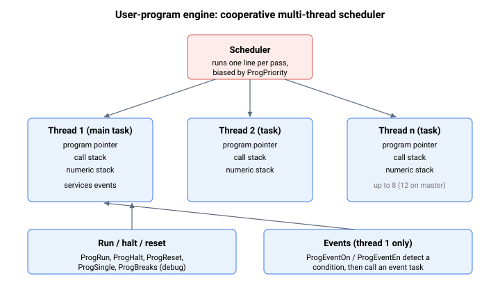

# 程序执行

本节涵盖用于加载、运行、停止、调试和检测用户程序的关键字。用户程序在内置协作式调度器下以一个或多个独立**线程**运行——独立控制器最多支持 8 个线程，Central-i 主控最多支持 12 个线程。每个线程执行一个**任务**（[ProgTask](ProgTask.md) 标签后的代码；任务 1 为主程序），并维护各自的程序指针、调用栈和数值栈，多个任务可并行运行。每次调度轮次，控制器轮询至下一个到期的活动线程，并为该线程执行一条底层指令（一个程序指针步进），然后继续推进——线程以协作方式共享处理器，每轮次一条指令。每轮次"到期"的线程由 [ProgPriority](ProgPriority.md) 决定。



以下关键字分为几个组：加载与删除程序；运行、暂停与复位线程；调用函数与传递参数；使用断点、单步执行和快照进行调试；定义与处理事件；以及向上位机流式传输状态。

下表汇总了程序执行关键字。

| 序号 | 关键字 | 说明 |
|-----|---------|---------|
| 1 | [DownloadUPBin](DownloadUPBin.md) | 将已编译的用户程序二进制镜像传输至控制器程序存储器。 |
| 2 | [ProgErase](ProgErase.md) | 从控制器存储器中擦除已存储的用户程序。 |
| 3 | [ProgInfo](ProgInfo.md) | 报告已加载用户程序中嵌入的信息字符串。 |
| 4 | [ProgTask](ProgTask.md) | 标记可调用任务起始位置的标签。 |
| 5 | [ProgRun](ProgRun.md) | 以指定线程编号运行（或恢复）任务。 |
| 6 | [ProgPriority](ProgPriority.md) | 设置线程的调度优先级（服务间隔）。 |
| 7 | [ProgHalt](ProgHalt.md) | 停止指定线程；可在停止处恢复执行。 |
| 8 | [ProgHaltThis](ProgHaltThis.md) | 停止当前正在执行的线程。 |
| 9 | [ProgHaltAll](ProgHaltAll.md) | 停止所有当前活动的线程。 |
| 10 | [ProgReset](ProgReset.md) | 将线程复位至初始状态。 |
| 11 | [ProgResetAll](ProgResetAll.md) | 停止所有线程并复位所有指针和栈。 |
| 12 | [ProgStat](ProgStat.md) | 单个线程的运行状态。 |
| 13 | [ProgStatAll](ProgStatAll.md) | 所有线程的综合状态。 |
| 14 | [ProgError](ProgError.md) | 各线程的最后一次运行时错误码。 |
| 15 | [ProgPointer](ProgPointer.md) | 各线程的当前指令指针（字节偏移量）。 |
| 16 | [ProgLine](ProgLine.md) | 正在执行线程的当前源代码行号。 |
| 17 | [ChooseAxis](ChooseAxis.md) | 各线程选择其操作的轴。 |
| 18 | [ProgFunc](ProgFunc.md) | 标记函数起始位置的标签。 |
| 19 | [ProgFuncCall](ProgFuncCall.md) | 调用由 ProgFunc 标签定义的函数。 |
| 20 | [Return](Return.md) | 从函数调用返回至调用行的下一行。 |
| 21 | [ProgPushArg](ProgPushArg.md) | 为即将进行的函数调用暂存参数（实参）。 |
| 22 | [ProgArgThis](ProgArgThis.md) | 读取当前函数接收到的参数（实参）。 |
| 23 | [ProgArg](ProgArg.md) | 从函数外部读取线程的参数（实参）槽。 |
| 24 | [ProgCallStack](ProgCallStack.md) | 各线程的程序调用栈内容。 |
| 25 | [ProgCallDepth](ProgCallDepth.md) | 调用栈的剩余空闲空间。 |
| 26 | [ProgClrCall](ProgClrCall.md) | 清除线程的程序调用栈。 |
| 27 | [ProgExpStack](ProgExpStack.md) | 读取数值（表达式）栈上的值而不弹出。 |
| 28 | [ProgExpDepth](ProgExpDepth.md) | 数值栈的剩余空闲空间。 |
| 29 | [ProgClrExp](ProgClrExp.md) | 清除数值（表达式）栈。 |
| 30 | [ProgHeap](ProgHeap.md) | 用户程序运行时使用的共享内存堆。 |
| 31 | [Compare](Compare.md) | 弹出栈值并比较，压入 1 或 0。 |
| 32 | [Jump](Jump.md) | 将执行跳转至程序中的另一个位置。 |
| 33 | [Math](Math.md) | 对数值栈顶执行数学运算。 |
| 34 | [ProgSingle](ProgSingle.md) | 单步执行线程（调试器单步进入/单步跳过）。 |
| 35 | [ProgBreaks](ProgBreaks.md) | 各线程的断点设置（用于调试）。 |
| 36 | [ProgBreakThis](ProgBreakThis.md) | 在当前正在执行的线程上设置断点。 |
| 37 | [ProgSnapSrc](ProgSnapSrc.md) | 选择程序快照捕获的参数。 |
| 38 | [ProgSnapVal](ProgSnapVal.md) | 保存程序快照捕获的值。 |
| 39 | [ProgEventOn](ProgEventOn.md) | 用户程序事件系统的主开关。 |
| 40 | [ProgEventGEn](ProgEventGEn.md) | 所有事件处理的全局使能。 |
| 41 | [ProgEventEn](ProgEventEn.md) | 使能或禁用单个事件的处理。 |
| 42 | [ProgEventPar](ProgEventPar.md) | 选择触发事件的参数。 |
| 43 | [ProgEventType](ProgEventType.md) | 事件的触发类型（边沿、等于、不等于……）。 |
| 44 | [ProgEventVal](ProgEventVal.md) | 事件触发检测所用的比较值。 |
| 45 | [ProgEventMask](ProgEventMask.md) | 应用于事件触发的位掩码。 |
| 46 | [ProgEventStat](ProgEventStat.md) | 报告各事件的状态并清除待处理事件。 |
| 47 | [PStatOn](PStatOn.md) | 使能或禁用周期性参数统计流式传输。 |
| 48 | [PStatParams](PStatParams.md) | 每次周期性传输中包含的参数。 |
| 49 | [PStatPort](PStatPort.md) | 流式传输使用的通信端口。 |
| 50 | [PStatInterval](PStatInterval.md) | 两次传输之间的间隔。 |

## 演练：运行带事件处理程序的编号任务

一种常见模式是在独立线程上启动长时运行的任务，同时让独立的事件处理程序在任务运行期间响应控制器条件。各组件连接方式如下。

1. 加载已编译的程序（[DownloadUPBin](DownloadUPBin.md)）并验证其已存在（[ProgInfo](ProgInfo.md)）。程序中包含目标任务（例如任务 `5`）的 [ProgTask](ProgTask.md) 标签，以及仅在事件触发时才到达的 [ProgFunc](ProgFunc.md) 式处理程序。
2. 配置需要处理的事件——例如，每当 [StatReg](../../07-status-and-faults/StatReg.md) 第 17 位（RLS）有效时触发事件 1。四个触发参数为以事件编号为索引的非轴数组：

   ```text
   AProgEventPar[1]=<complex CAN code of StatReg on axis A>   ; 监控对象
   AProgEventMask[1]=131072                                   ; 掩码：第 17 位
   AProgEventType[1]=5                                        ; 上升沿条件
   AProgEventVal[1]=0                                         ; 从 0 跳变至非零
   AProgEventEn[1]=1                                          ; 使能事件 1 的处理
   ```

3. 整体使能事件系统，然后在某线程上启动任务：

   ```text
   AProgEventOn=1     ; 主开关：检测并处理所有已使能事件
   AProgRun[2],5      ; 在线程 2 上运行任务 5；事件处理程序始终在线程 1 上运行（固件硬连接），因此将长时运行的工作启动在其他任何线程上，可保持线程 1 空闲以处理事件
   ```

4. 任务运行期间，用 [ProgStat](ProgStat.md) 轮询其状态。当被监控条件发生时，控制器将事件 1 移至"待处理"状态（[ProgEventStat](ProgEventStat.md) = `1`），在线程 1 上运行处理程序，并在处理程序执行 [Return](Return.md) 时重新置位事件：

   ```text
   AProgStat[2]            ; 任务 5 运行中为 1，完成或停止后为 0
   AProgEventStat[1]       ; 0 等待，1 待处理，2 处理中
   AProgError[2]           ; 线程 2 因错误停止时为非零
   ```

5. 如需在不丢失执行位置的情况下暂停和恢复线程 2，先停止再以任务值 `0` 重新运行；如需从头开始，先复位再运行：

   ```text
   AProgHalt[2]            ; 暂停线程 2（线程 1 上的事件处理不受影响）
   AProgRun[2],0           ; 从停止处恢复线程 2
   AProgReset[2]           ; …或复位线程 2，使下次 ProgRun 从任务 1 开始
   ```

随时将 `AProgEventOn=0` 可强制所有事件返回"等待触发"状态并丢弃所有待处理项；如需在不丢失待处理状态的情况下进行单事件控制，使用 [ProgEventEn](ProgEventEn.md)；全局处理门控使用 [ProgEventGEn](ProgEventGEn.md)。
