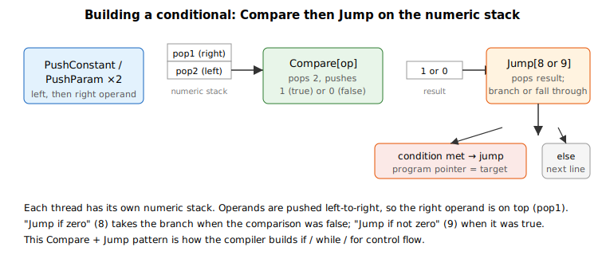

# Compare

Low-level user-program op that pops two stack values, compares them, and pushes 1 or 0.

## Overview

`Compare` is a low-level user-program language keyword. Syntax involving `Compare` is normally generated automatically by the PC Suite during compilation rather than written by hand, so it underpins the relational operators used in program flow control such as the conditions consumed by [Jump](Jump.md).

`Compare` pops one or two values from the numeric stack and compares them. If the result is true it pushes `1` onto the stack; if false it pushes `0`. The index value selects which comparison is performed (and the operand data type), and the operands must be pushed onto the stack before `Compare` is called. The result is pushed back onto the numeric stack; if the function is called over communication, the value is also returned through communication.

Throughout this page, `pop1` is the value popped first (the top of the stack) and `pop2` is the value popped next (the one beneath it). The two-operand comparisons read as `pop2 (operator) pop1`: for example, the "greater than" operation is true when `pop2 > pop1`. Because the operand pushed first ends up beneath the operand pushed last, this means the test reads in the natural left-to-right order of the source expression — the left operand is pushed first, the right operand second.

## How it works

The index selects both the comparison and the operand data type. On v4 (standalone and Central-i) the eight comparisons are available for **32-bit integer** operands only — operation index `2`–`9`. On Central-i v5 the same eight comparisons are also provided for **32-bit float** (`10`–`17`), **64-bit integer** (`18`–`25`) and **64-bit double-precision float** (`26`–`33`), so the operation index ranges from `2` to `33`. The numbering starts at 2 for compatibility with the operation numbering used by related keywords; using a float/long/double index on a v4 controller is rejected as an out-of-range operation.

| Operation | 32-bit integer | float | 64-bit integer | double | True if |
| --------- | -------------- | ----- | -------------- | ------ | ------- |
| `==` (equal)         | 2 | 10 | 18 | 26 | pop2 == pop1 |
| `>` (greater than)   | 3 | 11 | 19 | 27 | pop2 > pop1  |
| `>=` (greater/equal) | 4 | 12 | 20 | 28 | pop2 >= pop1 |
| `<` (less than)      | 5 | 13 | 21 | 29 | pop2 < pop1  |
| `<=` (less/equal)    | 6 | 14 | 22 | 30 | pop2 <= pop1 |
| `!=` (not equal)     | 7 | 15 | 23 | 31 | pop2 != pop1 |
| Zero                 | 8 | 16 | 24 | 32 | pop1 == 0    |
| Not zero             | 9 | 17 | 25 | 33 | pop1 != 0    |

The "Zero" and "Not zero" operations take a single operand (`pop1`); all other operations take two. The operands must already be on the stack, and they are removed by the comparison. The single `1` or `0` result it pushes is exactly what a conditional [Jump](Jump.md) (operation 8, "jump if zero", or operation 9, "jump if not zero") then consumes — so a relational test followed by a conditional jump is how the compiler builds `if`, `while`, and `for` constructs.



## Examples

```text
; Generated by the PC Suite — push two operands, then compare
ACompare[2]          ; pop2 == pop1 ? push 1 : push 0
ACompare[5]          ; pop2 <  pop1 ? push 1 : push 0
ACompare[8]          ; pop1 == 0   ? push 1 : push 0  (single operand)
```

## See also

- [Jump](Jump.md) — conditional/unconditional program branching
- [Math](Math.md) — arithmetic and bitwise operations on the numeric stack
- [PushConstant](../03-stack-operation/PushConstant.md) — push a literal operand before comparing
- [ProgExpStack](ProgExpStack.md) — the user-program numeric (expression) stack
