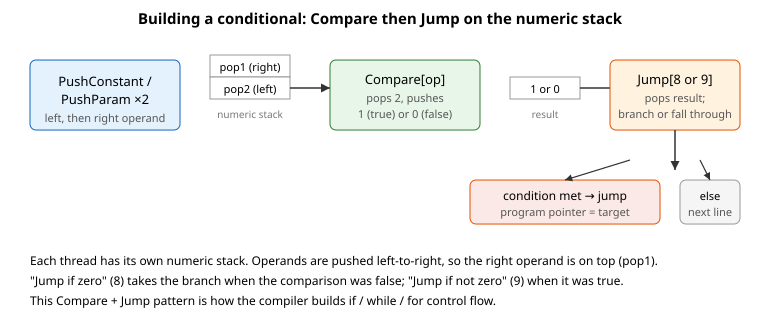

# Jump

低级用户程序操作码，将执行跳转到程序中的另一位置。

## 概述

`Jump` 是一个低级用户程序语言关键字，用于将程序执行重定向到另一位置。涉及 `Jump` 的语法只能由 PC Suite 在编译期间自动生成，因为该指令携带的目标是已编译程序文件中的偏移量，取决于文件的确切布局。出于同样原因，`Jump` 不能通过通信通道发出；它只能作为下载程序的一部分运行。它实现了构建循环和条件流程的跳转，通常作用于 [Compare](Compare.md) 压入数值栈的结果。

## 工作原理

`Jump` 接受操作索引和目标。目标通过将运行线程的程序指针设置为程序起始位置加目标偏移量来应用，从而从该位置继续执行。操作索引决定是否执行跳转：

- 操作 `1` 为**无条件**跳转——执行始终跳转至目标位置。
- **条件**操作从数值栈弹出操作数，仅在条件成立时跳转；否则继续执行下一条指令。

条件操作与 [Compare](Compare.md) 使用的比较集对应。在 v4（单机和 Central-i）上，条件操作仅涵盖 **32 位整数**操作数——索引 `2`–`9`。在 Central-i v5 上，相同的八种测试也为 **32 位浮点数**（`10`–`17`）、**64 位整数**（`18`–`25`）和 **64 位双精度浮点数**（`26`–`33`）提供。与 `Compare` 相同，`pop1` 是首先弹出的值（栈顶），`pop2` 是其下方的值；双操作数测试读作 `pop2 (运算符) pop1`。在 v4 控制器上选择浮点/长整型/双精度索引将被拒绝为超出范围的操作。

| 操作 | 32 位整数 | 浮点数 | 64 位整数 | 双精度 | 跳转条件 |
| --------- | -------------- | ----- | -------------- | ------ | ------- |
| 无条件        | 1 | — | — | — | 始终 |
| `==`（等于）         | 2 | 10 | 18 | 26 | pop2 == pop1 |
| `>`（大于）   | 3 | 11 | 19 | 27 | pop2 > pop1  |
| `>=`（大于等于） | 4 | 12 | 20 | 28 | pop2 >= pop1 |
| `<`（小于）      | 5 | 13 | 21 | 29 | pop2 < pop1  |
| `<=`（小于等于）    | 6 | 14 | 22 | 30 | pop2 <= pop1 |
| `!=`（不等于）     | 7 | 15 | 23 | 31 | pop2 != pop1 |
| 为零                 | 8 | 16 | 24 | 32 | pop1 == 0    |
| 非零             | 9 | 17 | 25 | 33 | pop1 != 0    |

在已编译程序中，最常见的模式是 [Compare](Compare.md)（在栈上留下 `1` 或 `0`）后跟"若为零则跳转"（操作 8）或"若非零则跳转"（操作 9）：比较构成条件，跳转实现分支。两者共同构建高级程序的 `if`、`while` 和 `for` 结构。

因此：
- `Compare` + `Jump[8]`（"若为零则跳转"）实现 `if (条件为假) goto 目标`——这是 `if (cond) {...}` 的自然形式，当条件不成立时编译器跳过主体。
- `Compare` + `Jump[9]`（"若非零则跳转"）实现 `if (条件为真) goto 目标`——用于 `while` 和 `for` 中的循环回边。

## 另请参阅

- [Compare](Compare.md) — 为条件跳转产生条件值
- [Math](Math.md) — 数值栈上的算术/位运算操作
- [ProgPointer](ProgPointer.md) — 当前程序执行指针
- [PushParam](../03-stack-operation/PushParam.md) / [PushConstant](../03-stack-operation/PushConstant.md) — 在 Compare 前压入操作数
