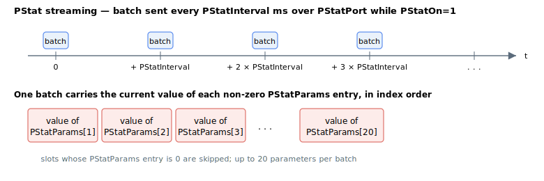

# PStatOn

Enables or disables periodic parameter-statistics streaming.

## Overview

`PStatOn` enables or disables the periodic program-status streaming feature: a background facility that automatically transmits a chosen set of parameters at a fixed time interval, so a host can monitor the controller without polling. When set to `1`, the controller transmits the parameters listed in [PStatParams](PStatParams.md) over the port configured by [PStatPort](PStatPort.md), repeating every [PStatInterval](PStatInterval.md) milliseconds. It is the master switch for the whole `PStat` group. It is a non-axis parameter and is not saved to flash (default `0`).

## How it works

While `PStatOn` is set, the controller tracks the time since the last transmission and, once it exceeds [PStatInterval](PStatInterval.md), sends one batch containing the current values of every configured [PStatParams](PStatParams.md) entry over the selected [PStatPort](PStatPort.md). Streaming runs in the background and yields to incoming commands, so it does not block normal communication on the port.



If a [PStatParams](PStatParams.md) entry names a parameter that cannot be resolved, the controller rejects the configuration: it reads back a negative (error) value instead of `0`/`1` and the offending entry is cleared. In that case, correct [PStatParams](PStatParams.md) and re-enable `PStatOn`.

## Examples

```text
APStatOn=1           ; start periodic status streaming
APStatOn=0           ; stop streaming
```

## See also

- [PStatParams](PStatParams.md) — parameters included in each transmission
- [PStatPort](PStatPort.md) — communication port used for streaming
- [PStatInterval](PStatInterval.md) — interval between transmissions
