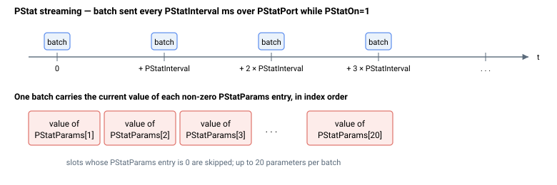

# PStatOn

启用或禁用周期性参数统计流式传输。

## 概述

`PStatOn` 启用或禁用周期性程序状态流式传输功能：该后台功能以固定时间间隔自动发送一组选定参数，使上位机无需轮询即可监控控制器。设置为 `1` 时，控制器将 [PStatParams](PStatParams.md) 中列出的参数通过 [PStatPort](PStatPort.md) 配置的端口发送，每隔 [PStatInterval](PStatInterval.md) 毫秒重复一次。它是整个 `PStat` 组的主开关，属于非轴参数，不保存至闪存（默认值 `0`）。

## 工作原理

`PStatOn` 处于置位状态时，控制器记录自上次发送以来经过的时间，一旦超过 [PStatInterval](PStatInterval.md)，即通过所选 [PStatPort](PStatPort.md) 发送一批包含每个已配置 [PStatParams](PStatParams.md) 条目当前值的数据。流式传输在后台运行，并让步于传入的指令，因此不会阻塞端口上的正常通信。



若某个 [PStatParams](PStatParams.md) 条目所指定的参数无法解析，控制器将拒绝该配置：读回一个负值（错误值）而非 `0`/`1`，且问题条目将被清除。此时请修正 [PStatParams](PStatParams.md) 后重新启用 `PStatOn`。

## 示例

```text
APStatOn=1           ; 启动周期性状态流式传输
APStatOn=0           ; 停止流式传输
```

## 另请参阅

- [PStatParams](PStatParams.md) — 每次发送所包含的参数
- [PStatPort](PStatPort.md) — 用于流式传输的通信端口
- [PStatInterval](PStatInterval.md) — 发送间隔
