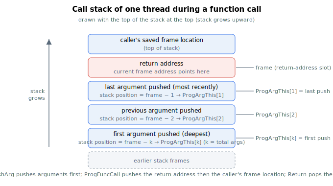

# ProgFuncCall

Calls a user program function defined by a ProgFunc label.

## Overview

`ProgFuncCall` calls a user program function. When `AProgFuncCall,1` is reached, execution jumps to the location of the [ProgFunc](ProgFunc.md) label with index `1`. A [Return](Return.md) at the end of the function jumps back and continues on the next line after the call. Functions can call other functions; calls may be nested up to the depth of the call stack. Use multiple `ProgFunc[]` labels to define multiple functions, each invoked by its index (range `1`–`254`, or `1`–`40` on smaller models). It is a non-axis command and is not saved to flash.

> **Note:** Use [ProgHalt](ProgHalt.md) at the end of the program if it is not an endless loop. Otherwise execution continues into the first function and the `Return` keyword causes an error.

## How it works

Each running thread has its own *call stack* — a per-thread area that records where to return to. When `ProgFuncCall` runs, the engine:

1. Verifies the call exists (a [ProgFunc](ProgFunc.md) label with the requested index must be defined) and that the call stack has room (at least two free slots are required). If the stack is full the command fails with a stack-full error.
2. Pushes the *return address* — the location of the next line after the `ProgFuncCall` — onto the call stack.
3. Pushes the caller's *frame location* and makes the new frame point at the return-address slot. The frame location is the reference point used by [ProgArgThis](ProgArgThis.md) and [ProgArg](ProgArg.md) to find arguments.
4. Jumps execution to the [ProgFunc](ProgFunc.md) label.

If arguments were staged with [ProgPushArg](ProgPushArg.md) before the call, they sit on the call stack just below the return address and become the function's input arguments (see [ProgArgThis](ProgArgThis.md)). The matching [Return](Return.md) unwinds this frame.



The call stack holds up to 100 entries per thread; each `ProgFuncCall` consumes at least two of them (return address plus frame location), plus one per pushed argument. Use [ProgCallDepth](ProgCallDepth.md) to monitor the free space and [ProgCallStack](ProgCallStack.md) to inspect the contents.

## Examples

```text
AProgFuncCall,1     ; jump to ProgFunc[1]; Return resumes on the next line

AProgPushArg=10     ; stage one input argument...
AProgPushArg=20     ; ...and another
AProgFuncCall,2     ; call function 2 with two input arguments
```

## See also

- [ProgFunc](ProgFunc.md) — label marking the start of a function
- [Return](Return.md) — return from a function call
- [ProgPushArg](ProgPushArg.md) — stage an argument before the call
- [ProgArgThis](ProgArgThis.md) — read the arguments inside the function
- [ProgCallStack](ProgCallStack.md) — program-call stack contents
- [ProgCallDepth](ProgCallDepth.md) — free space remaining in the call stack
