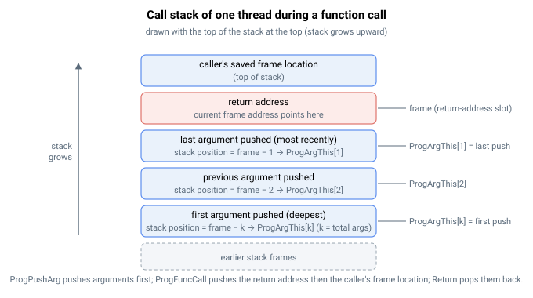

# ProgFuncCall

调用由 ProgFunc 标签定义的用户程序函数。

## 概述

`ProgFuncCall` 调用用户程序函数。当执行到 `AProgFuncCall,1` 时，执行将跳转到索引为 `1` 的 [ProgFunc](ProgFunc.md) 标签所在位置。函数末尾的 [Return](Return.md) 将跳回并从调用后的下一行继续执行。函数可调用其他函数；嵌套调用深度受调用栈深度限制。可使用多个 `ProgFunc[]` 标签定义多个函数，每个函数通过其索引调用（范围 `1`–`254`，较小型号为 `1`–`40`）。这是一个非轴指令，不保存至闪存。

> **注意：** 若程序不是无限循环，请在程序末尾使用 [ProgHalt](ProgHalt.md)。否则执行将继续进入第一个函数，`Return` 关键字将引发错误。

## 工作原理

每个运行中的线程都有各自的*调用栈*——一个记录返回地址的线程专属区域。`ProgFuncCall` 仅在用户程序运行时有效；从通信终端发送该指令将被拒绝。`ProgFuncCall` 执行时，引擎将：

1. 验证调用栈是否有足够空间（至少需要两个空闲槽），并确认调用目标存在（必须已定义具有所请求索引的 [ProgFunc](ProgFunc.md) 标签）。若栈已满，指令以栈满错误失败；若未找到匹配函数，则以函数未找到错误失败。
2. 将*返回地址*（`ProgFuncCall` 后一行的位置）压入调用栈。
3. 压入调用方的*帧位置*，并将新帧指向返回地址槽。帧位置是 [ProgArgThis](ProgArgThis.md) 和 [ProgArg](ProgArg.md) 查找参数时的参考点。
4. 将执行跳转至 [ProgFunc](ProgFunc.md) 标签处。

若在调用前使用 [ProgPushArg](ProgPushArg.md) 暂存了参数，这些参数位于返回地址正下方的调用栈上，成为函数的输入参数（参见 [ProgArgThis](ProgArgThis.md)）。对应的 [Return](Return.md) 将展开此帧。



每个线程的调用栈最多可容纳 100 个条目；每次 `ProgFuncCall` 至少消耗其中两个（返回地址加帧位置），每个压入的参数额外消耗一个。使用 [ProgCallDepth](ProgCallDepth.md) 监测剩余空闲空间，使用 [ProgCallStack](ProgCallStack.md) 检查栈内容。

## 示例

```text
AProgFuncCall,1     ; jump to ProgFunc[1]; Return resumes on the next line

AProgPushArg=10     ; stage one input argument...
AProgPushArg=20     ; ...and another
AProgFuncCall,2     ; call function 2 with two input arguments
```

## 另请参阅

- [ProgFunc](ProgFunc.md) — 标记函数起始位置的标签
- [Return](Return.md) — 从函数调用返回
- [ProgPushArg](ProgPushArg.md) — 调用前暂存参数
- [ProgArgThis](ProgArgThis.md) — 在函数内部读取参数
- [ProgCallStack](ProgCallStack.md) — 程序调用栈内容
- [ProgCallDepth](ProgCallDepth.md) — 调用栈剩余空闲空间
