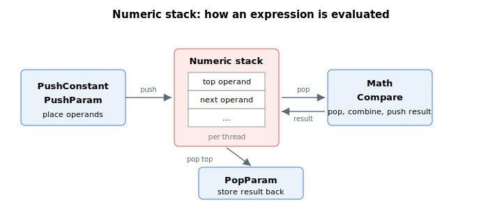

# Stack operation

This section covers the low-level user-program keywords that manipulate a thread's numeric (expression) stack and the wait instructions that pause a thread until a condition is met. Each running thread has its own numeric stack, on which operands are pushed, combined by arithmetic and comparison operations (see [Math](../02-program-execution/Math.md) and [Compare](../02-program-execution/Compare.md)), and then stored back into parameters. These keywords are normally emitted automatically by the PC Suite user-program compiler rather than written by hand.

Each thread's numeric stack holds up to 50 values, and the communication channel has its own stack as well. Pushing onto a full stack reports a stack-full error. The free space remaining in a thread's stack can be read at run time with [ProgExpDepth](../02-program-execution/ProgExpDepth.md), and the stack can be emptied with [ProgClrExp](../02-program-execution/ProgClrExp.md).

The following table summarizes the stack-operation keywords.

| No. | Keyword | Summary |
|-----|---------|---------|
| 1 | [PushParam](PushParam.md) | Pushes a parameter's value onto the numeric stack of the current thread. |
| 2 | [PushConstant](PushConstant.md) | Pushes a constant value onto the numeric stack of the current thread. |
| 3 | [PopParam](PopParam.md) | Pops the top value of the numeric stack into a parameter. |
| 4 | [WaitStatus](WaitStatus.md) | Holds a thread until a selected status reaches a required value. |
| 5 | [WaitTime](WaitTime.md) | Suspends the current thread for a specified time in milliseconds. |
