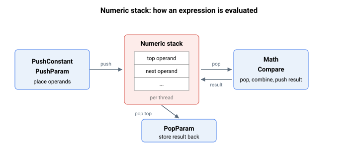

# 栈操作

本节介绍用于操作线程数值（表达式）栈的低级用户程序关键字，以及暂停线程直至满足某一条件的等待指令。每个运行中的线程都有其独立的数值栈，操作数在此栈上压入，经算术和比较运算（参见 [Math](../02-program-execution/Math.md) 和 [Compare](../02-program-execution/Compare.md)）处理后再存回参数。这些关键字通常由 PC Suite 用户程序编译器自动生成，而非手动编写。

每个线程的数值栈最多可容纳 50 个值，通信通道也有其独立的栈。向已满的栈压入数据将报告栈满错误。线程栈中剩余空闲空间可在运行时通过 [ProgExpDepth](../02-program-execution/ProgExpDepth.md) 读取，栈可通过 [ProgClrExp](../02-program-execution/ProgClrExp.md) 清空。

下表汇总了栈操作关键字。

| 序号 | 关键字 | 说明 |
|-----|---------|---------|
| 1 | [PushParam](PushParam.md) | 将参数值压入当前线程的数值栈。 |
| 2 | [PushConstant](PushConstant.md) | 将常量值压入当前线程的数值栈。 |
| 3 | [PopParam](PopParam.md) | 将数值栈顶值弹出并写入参数。 |
| 4 | [WaitStatus](WaitStatus.md) | 保持线程等待，直至所选状态达到所需值。 |
| 5 | [WaitTime](WaitTime.md) | 将当前线程挂起指定时间（毫秒）。 |
