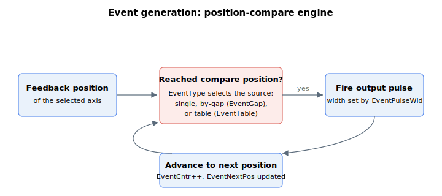

# Event generation

The event-generation feature lets the controller produce digital pulses on a designated output when the feedback position reaches a compare position. It is used for position-synchronized output triggering (for example, firing a camera, marker, or external device at precise positions along a move).



Configure the generator with these keywords:

- Master switch and mode: [EventOn](EventOn.md), [EventSelect](EventSelect.md), [EventType](EventType.md), [EventAlwaysOn](EventAlwaysOn.md)
- Position ranges (single / by gap): [EventBegPos](EventBegPos.md), [EventEndPos](EventEndPos.md), [EventGap](EventGap.md)
- Pulse shape: [EventPulseWid](EventPulseWid.md), [EventPulseRes](EventPulseRes.md)
- Suppress (central-i v4 only): [EventSuppress](EventSuppress.md) — momentarily suppresses event-pulse emission in the remote drive's compare hardware
- Position tables: [EventTable](EventTable.md), [EventTableBeg](EventTableBeg.md), [EventTableEnd](EventTableEnd.md), [EventTableSel](EventTableSel.md), [EventTableSrc](EventTableSrc.md), [EventTableWid](EventTableWid.md), [EventTableCor](EventTableCor.md), [EventCorrect](EventCorrect.md)
- Rollover: [EventRollCntr](EventRollCntr.md), [EventRollOff](EventRollOff.md)
- Status: [EventCntr](EventCntr.md), [EventNextPos](EventNextPos.md), [EventLoopback](EventLoopback.md)

## Walk-through: generate a position-compare pulse train

A typical use is to fire a pulse on the event output every N user units across a window — for example, to step an external trigger every 2000 counts between positions 1000 and 7000 during a single move. The configuration uses by-gap mode ([EventType](EventType.md) = `1`):

1. Set the compare scheme and the window:

   ```text
   AEventType=1         ; by-gap mode
   AEventBegPos=1000    ; first event position
   AEventEndPos=7000    ; window end (sets direction together with EventBegPos)
   AEventGap=2000       ; spacing between events
   ```

2. Set the pulse shape and the output routing. Pulse width is set with the unit selected by [EventPulseRes](EventPulseRes.md); pick one or the other before writing [EventPulseWid](EventPulseWid.md):

   ```text
   AEventPulseRes=0     ; pulse width is in microseconds (default)
   AEventPulseWid=50    ; 50 us output pulse per event
   AEventSelect=1       ; select the output line (product-specific)
   ```

3. Arm before the axis reaches `EventBegPos` in the watched direction. Arming resets [EventCntr](EventCntr.md) to `0` and loads the first compare position into [EventNextPos](EventNextPos.md):

   ```text
   AEventOn=1           ; arm; set while the axis is below EventBegPos (positive-direction window)
   ```

4. Move the axis through the window. As each compare position is crossed, the event output pulses for `EventPulseWid` and [EventCntr](EventCntr.md) increments. The generator advances by `EventGap` and reloads [EventNextPos](EventNextPos.md). For the values above, pulses appear at positions 1000, 3000, 5000 and 7000 — a total of four:

   ```text
   AEventCntr           ; how many pulses have fired since arming
   AEventNextPos        ; the position at which the next pulse will fire
   ```

5. Once `EventNextPos` would pass `EventEndPos`, generation stops and `AEventOn` returns to `0`. To restart the same window, toggle `AEventOn` from `0` to `1` again. To keep firing forever (no end check), set [EventAlwaysOn](EventAlwaysOn.md) = `1`.

For a series of arbitrary, non-uniform positions use [EventType](EventType.md) = `2` (or `3` for hardware-buffered) and load the positions into [EventTable](EventTable.md), bounded by [EventTableBeg](EventTableBeg.md) / [EventTableEnd](EventTableEnd.md). Per-entry output lines come from [EventTableSel](EventTableSel.md), and per-entry pulse widths from [EventTableWid](EventTableWid.md). To verify pulses too short to see externally, read [EventCntr](EventCntr.md) — it counts every fired pulse, including those briefer than the loopback can observe.

On standalone products, arming `AEventOn=1` automatically clears the position-capture enable ([LockEn](../03-encoder/03-event-based-feedback-logging/LockEn-AuxLockEn.md)) because the compare output and the capture trigger share the same pin; on Central-i products the two features use independent hardware.
