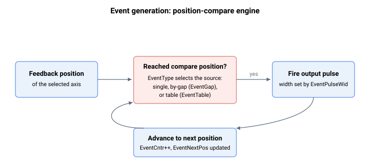

# 事件生成

事件生成功能允许控制器在反馈位置到达比较位置时，在指定输出上产生数字脉冲。该功能用于位置同步输出触发（例如，在运动过程中的精确位置触发相机、标记器或外部设备）。



使用以下关键字配置生成器：

- 主开关与模式：[EventOn](EventOn.md)、[EventSelect](EventSelect.md)、[EventType](EventType.md)、[EventAlwaysOn](EventAlwaysOn.md)
- 位置范围（单次 / 按间隔）：[EventBegPos](EventBegPos.md)、[EventEndPos](EventEndPos.md)、[EventGap](EventGap.md)
- 脉冲形状：[EventPulseWid](EventPulseWid.md)、[EventPulseRes](EventPulseRes.md)
- 抑制（仅限 central-i v4）：[EventSuppress](EventSuppress.md) — 短暂抑制远程驱动器比较硬件中的事件脉冲发射
- 位置表：[EventTable](EventTable.md)、[EventTableBeg](EventTableBeg.md)、[EventTableEnd](EventTableEnd.md)、[EventTableSel](EventTableSel.md)、[EventTableSrc](EventTableSrc.md)、[EventTableWid](EventTableWid.md)、[EventTableCor](EventTableCor.md)、[EventCorrect](EventCorrect.md)
- 循环回绕：[EventRollCntr](EventRollCntr.md)、[EventRollOff](EventRollOff.md)
- 状态：[EventCntr](EventCntr.md)、[EventNextPos](EventNextPos.md)、[EventLoopback](EventLoopback.md)

## 操作示例：生成位置比较脉冲序列

典型用法是在一个窗口内每隔 N 个用户单位在事件输出上触发一个脉冲——例如，在单次运动中，在位置 1000 至 7000 之间每隔 2000 个计数步进一次外部触发。该配置使用按间隔模式（[EventType](EventType.md) = `1`）：

1. 设置比较方案和窗口：

   ```text
   AEventType=1         ; by-gap mode
   AEventBegPos=1000    ; first event position
   AEventEndPos=7000    ; window end (sets direction together with EventBegPos)
   AEventGap=2000       ; spacing between events
   ```

2. 设置脉冲形状和输出路由。脉冲宽度以 [EventPulseRes](EventPulseRes.md) 选定的单位设置；在写入 [EventPulseWid](EventPulseWid.md) 之前先选择其中一项：

   ```text
   AEventPulseRes=0     ; pulse width is in microseconds (default)
   AEventPulseWid=50    ; 50 us output pulse per event
   AEventSelect=1       ; select the output line (product-specific)
   ```

3. 在轴到达被监视方向上的 `EventBegPos` 之前置位。置位操作将 [EventCntr](EventCntr.md) 重置为 `0`，并将第一个比较位置加载到 [EventNextPos](EventNextPos.md) 中：

   ```text
   AEventOn=1           ; arm; set while the axis is below EventBegPos (positive-direction window)
   ```

4. 驱动轴穿过该窗口。每次越过比较位置时，事件输出脉冲持续 `EventPulseWid`，[EventCntr](EventCntr.md) 递增。生成器按 `EventGap` 步进并重新加载 [EventNextPos](EventNextPos.md)。按照上述参数，脉冲将出现在位置 1000、3000、5000 和 7000，共四次：

   ```text
   AEventCntr           ; how many pulses have fired since arming
   AEventNextPos        ; the position at which the next pulse will fire
   ```

5. 一旦 `EventNextPos` 超过 `EventEndPos`，生成停止，`AEventOn` 返回 `0`。若要重新启动同一窗口，将 `AEventOn` 从 `0` 切换回 `1` 即可。若要持续触发（不进行结束检查），将 [EventAlwaysOn](EventAlwaysOn.md) 设置为 `1`。

对于一系列任意的非均匀位置，使用 [EventType](EventType.md) = `2`（或 `3` 用于硬件缓冲）并将位置加载到 [EventTable](EventTable.md) 中，由 [EventTableBeg](EventTableBeg.md) / [EventTableEnd](EventTableEnd.md) 界定。各条目的输出线来自 [EventTableSel](EventTableSel.md)，各条目的脉冲宽度来自 [EventTableWid](EventTableWid.md)。若要验证短暂到外部无法观测的脉冲，可读取 [EventCntr](EventCntr.md)——它统计每一次触发的脉冲，包括比回读所能观察到的更短的脉冲。

在独立产品中，置位 `AEventOn=1` 会自动清除位置捕获使能（[LockEn](../03-encoder/03-event-based-feedback-logging/LockEn-AuxLockEn.md)），因为比较输出与捕获触发共用同一引脚；在 Central-i 产品中，这两项功能使用独立硬件。
