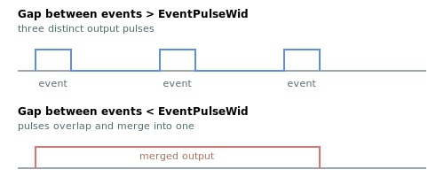

# EventPulseWid

Duration of the event output pulse in microseconds.

## Overview

`EventPulseWid` sets the duration of the event output pulse, determining how long the output signal stays active after each event trigger. The width is expressed in microseconds by default, or in nanoseconds if [EventPulseRes](EventPulseRes.md) = 1. With small [EventGap](EventGap.md) values at high velocity, a large pulse width can cause successive pulses to overlap. Per-entry overrides for table-driven events are set with [EventTableWid](EventTableWid.md). It is an axis-related parameter saved to flash and can be changed at any time.

## How it works

The sign and magnitude of the value control the output:

| Value | Output behavior |
|-------|-----------------|
| Positive | A pulse of that duration with normal polarity (output drives active, then returns to idle). |
| 0 | Toggle mode: the output changes state at each event instead of producing a fixed-duration pulse. |
| Negative | A pulse of that magnitude (duration) with inverted polarity. |

When events are armed, the controller converts the width into the pulse generator's internal timebase, automatically choosing a coarse or fine internal time step so that both short and long pulses are timed accurately. Because the pulse has a fixed duration in time (not in position), the *distance* the axis travels during the pulse grows with velocity. The diagram shows how successive pulses can overlap when the time the axis takes to cross [EventGap](EventGap.md) is shorter than the pulse width:



## Examples

```text
AEventPulseWid=50    ; 50 us output pulse (default unit)
AEventPulseWid=-50   ; 50 us pulse, inverted polarity
AEventPulseWid=0     ; toggle the output at each event instead of pulsing
AEventPulseWid       ; query the current pulse width
```

## See also

- [EventPulseRes](EventPulseRes.md) — selects the pulse-width time unit (microseconds or nanoseconds)
- [EventTableWid](EventTableWid.md) — per-entry pulse width override
- [EventGap](EventGap.md) — small gaps with wide pulses can overlap
