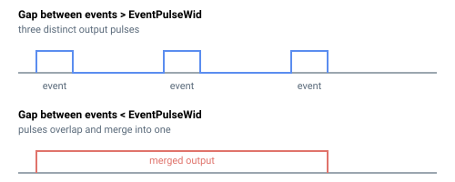

# EventPulseWid

事件输出脉冲的持续时间，单位为微秒。

## 概述

`EventPulseWid` 设置事件输出脉冲的持续时间，决定每次事件触发后输出信号保持有效的时长。默认情况下宽度以微秒表示，若 [EventPulseRes](EventPulseRes.md) = 1 则以纳秒表示。在高速度下使用较小的 [EventGap](EventGap.md) 时，较大的脉冲宽度可能导致相邻脉冲重叠。表驱动事件的每项覆盖值由 [EventTableWid](EventTableWid.md) 设置。该参数是轴相关参数，保存至闪存，可随时更改。

## 工作原理

值的符号和大小控制输出行为：

| 值 | 输出行为 |
|-------|-----------------|
| 正值 | 该持续时间的脉冲，极性正常（输出驱动为有效，然后返回空闲）。 |
| 0 | 切换模式：每次事件时输出改变状态，而不是产生固定持续时间的脉冲。 |
| 负值 | 该绝对值（持续时间）的脉冲，极性反转。 |

使能事件时，控制器将宽度转换为脉冲生成器的内部时基，自动选择粗步长或细步长内部时间步，使短脉冲和长脉冲均能精确计时。由于脉冲持续时间固定（而非固定位置长度），轴在脉冲期间移动的*距离*随速度增大而增大。下图展示了当轴跨越 [EventGap](EventGap.md) 所需时间短于脉冲宽度时，相邻脉冲如何重叠：



输出持续时间由硬件定时器产生，因此宽度量化为定时器步长。在使用增量式或 SIN-COS 反馈的 Central-i 远程驱动器上，对于约 **163.8 us** 以内的脉冲，步长约为 **20 ns**；对于更长的脉冲，步长为 **5.12 us**，最大约为 **1.34 秒**；独立产品使用不同的定时器，最大值更短。请求的宽度量化到定时器步长（截断至最接近的较低步长），超过最长可产生脉冲的宽度将被钳位至该最大值。

## 示例

```text
AEventPulseWid=50    ; 50 us 输出脉冲（默认单位）
AEventPulseWid=-50   ; 50 us 脉冲，极性反转
AEventPulseWid=0     ; 每次事件时切换输出，而非脉冲
AEventPulseWid       ; 查询当前脉冲宽度
```

## 另请参阅

- [EventPulseRes](EventPulseRes.md) — 选择脉冲宽度时间单位（微秒或纳秒）
- [EventTableWid](EventTableWid.md) — 每项脉冲宽度覆盖值
- [EventGap](EventGap.md) — 间距较小且脉冲较宽时可能发生重叠
