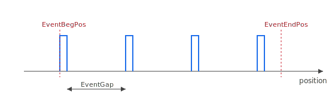

# EventType

Selects the compare scheme for event generation (single, by-gap, or by-table).

## Overview

Events are pulses on a designated output generated when the actual feedback position equals a required compare position. `EventType` determines how those compare positions are derived, and is armed with [EventOn](EventOn.md). The pulse shape is set by [EventPulseWid](EventPulseWid.md).

## How it works

| Value | Compare scheme |
|-------|----------------|
| 0 | **Single event** — one pulse is generated when the feedback position reaches [EventBegPos](EventBegPos.md), then generation stops and [EventOn](EventOn.md) returns to `0`. |
| 1 | **Event by gap** — a first pulse is generated at [EventBegPos](EventBegPos.md); a further pulse is generated each time the distance set by [EventGap](EventGap.md) is passed. Pulses stop once the position passes [EventEndPos](EventEndPos.md) (unless [EventAlwaysOn](EventAlwaysOn.md) forces continuous operation). |
| 2 | **Events by table** — a table of compare positions is used, bounded by [EventTableBeg](EventTableBeg.md) (start index) and [EventTableEnd](EventTableEnd.md) (end index). The controller loads each position in turn and reloads [EventSelect](EventSelect.md) from [EventTableSel](EventTableSel.md) for every event, so each position can fire on a chosen output line. Compare positions are taken from [EventTable](EventTable.md), or from the corrected table [EventTableCor](EventTableCor.md) when so selected. |
| 3 | **Events by table (hardware-buffered)** — same table-driven scheme as mode 2, but the full list of compare positions is pre-loaded into the compare hardware's buffer (FIFO) at arming rather than reloaded one at a time. This supports higher event rates than mode 2 because the hardware advances through the buffered positions without per-event servicing. Available where the compare hardware supports it. |
| 4 | **Trigger now** — fires a single pulse immediately when [EventOn](EventOn.md) is set, without waiting for a position crossing. Use it to assert the event output on demand (for example, to test downstream wiring). |

The by-gap scheme produces a regular pulse train across the window:



### Hardware behavior

A compare match is edge-detected: exactly one output action is produced each time the feedback position crosses a compare position, so the axis must move away from a compare position and re-reach it before that position can fire again. When [EventPulseWid](EventPulseWid.md) selects toggle mode, the output flips state on each event and holds that state until the next event (it is not re-armed per pulse); it returns to the idle level when generation is disarmed — that is, once the end position or count is reached, or the unit is reset.

## Examples

```text
AEventType=0         ; single event at EventBegPos
AEventType=1         ; event by gap
AEventType=2         ; events by table
AEventType=3         ; events by table, hardware-buffered
AEventType=4         ; trigger one event immediately on EventOn
AEventType          ; query the current compare scheme
```

## See also

- [EventOn](EventOn.md) — arms event generation for the selected type
- [EventBegPos](EventBegPos.md) — first event position (modes 0 and 1)
- [EventGap](EventGap.md) — spacing between events (mode 1)
- [EventEndPos](EventEndPos.md) — last event position (mode 1)
- [EventAlwaysOn](EventAlwaysOn.md) — continuous (endless) by-gap generation (mode 1)
- [EventTable](EventTable.md) / [EventTableCor](EventTableCor.md) — position tables (modes 2 and 3)
- [EventTableSel](EventTableSel.md) — per-entry output-line selection (modes 2 and 3)
