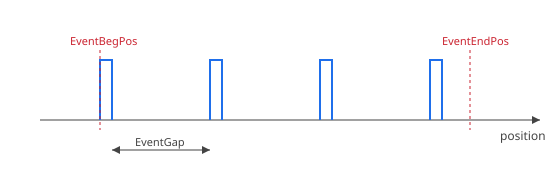

# EventType

选择事件生成的比较方案（单次、按间距或按表）。

## 概述

事件是当实际反馈位置等于所需比较位置时在指定输出上产生的脉冲。`EventType` 决定比较位置的来源，通过 [EventOn](EventOn.md) 使能。脉冲形状由 [EventPulseWid](EventPulseWid.md) 设定。

## 工作原理

| 值 | 比较方案 |
|-------|----------------|
| 0 | **单次事件** — 当反馈位置到达 [EventBegPos](EventBegPos.md) 时产生一个脉冲，随后停止生成并将 [EventOn](EventOn.md) 返回至 `0`。 |
| 1 | **按间距生成事件** — 在 [EventBegPos](EventBegPos.md) 处产生第一个脉冲；此后每经过 [EventGap](EventGap.md) 设定的距离产生一个脉冲。位置超过 [EventEndPos](EventEndPos.md) 后脉冲停止（除非 [EventAlwaysOn](EventAlwaysOn.md) 强制持续运行）。 |
| 2 | **按表生成事件** — 使用一组比较位置表，范围由 [EventTableBeg](EventTableBeg.md)（起始索引）和 [EventTableEnd](EventTableEnd.md)（结束索引）限定。控制器依次加载每个位置，并为每次事件从 [EventTableSel](EventTableSel.md) 重新加载 [EventSelect](EventSelect.md)，使每个位置可在选定的输出线上触发。比较位置来自 [EventTable](EventTable.md)，或在选定时来自已校正表 [EventTableCor](EventTableCor.md)。 |
| 3 | **按表生成事件（硬件缓冲）** — 与模式 2 的表驱动方案相同，但在使能时将完整的比较位置列表预加载至比较硬件的缓冲区（FIFO），而非逐条重新加载。由于硬件无需按事件处理即可推进缓冲位置，该模式支持比模式 2 更高的事件速率。仅在比较硬件支持的情况下可用。 |
| 4 | **立即触发** — 设置 [EventOn](EventOn.md) 时立即触发单个脉冲，无需等待位置穿越。用于按需断言事件输出（例如测试下游接线）。 |

按间距方案在窗口范围内产生规律的脉冲序列：



### 硬件行为

比较匹配采用边沿检测：每次反馈位置穿越比较位置时仅产生一次输出动作，因此轴必须离开比较位置并重新到达，该位置才能再次触发。当 [EventPulseWid](EventPulseWid.md) 选择切换模式时，输出在每次事件时翻转状态并保持直至下一次事件（不按脉冲重新使能）；当生成被撤销使能时（即到达结束位置或计数，或单元复位后），输出返回空闲电平。

## 示例

```text
AEventType=0         ; 在 EventBegPos 处产生单次事件
AEventType=1         ; 按间距生成事件
AEventType=2         ; 按表生成事件
AEventType=3         ; 按表生成事件，硬件缓冲
AEventType=4         ; EventOn 置位时立即触发一次事件
AEventType          ; 查询当前比较方案
```

## 另请参阅

- [EventOn](EventOn.md) — 为选定类型使能事件生成
- [EventBegPos](EventBegPos.md) — 第一个事件位置（模式 0 和 1）
- [EventGap](EventGap.md) — 事件间距（模式 1）
- [EventEndPos](EventEndPos.md) — 最后一个事件位置（模式 1）
- [EventAlwaysOn](EventAlwaysOn.md) — 按间距持续（无限）生成（模式 1）
- [EventTable](EventTable.md) / [EventTableCor](EventTableCor.md) — 位置表（模式 2 和 3）
- [EventTableSel](EventTableSel.md) — 按条目输出线选择（模式 2 和 3）
