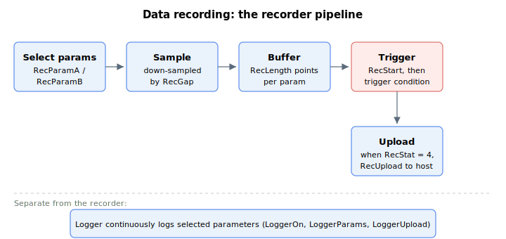
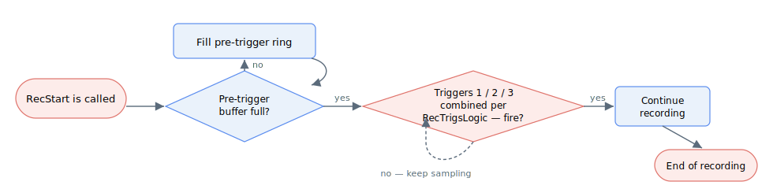
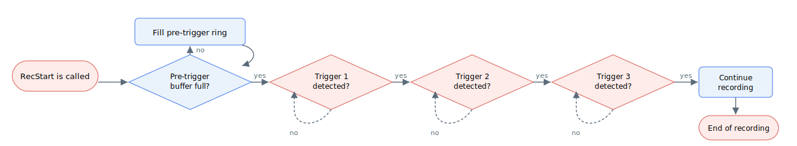

# Data recording

Data recording lets the user record a time series of any set of parameters. The recorded data are stored within the controller and can be streamed to the PC afterwards.



Depending on the product, the number of scopes and the maximum data points per scope vary. The following table shows the summary of the recording capability of each product.

| Properties | Limits |
|---|---|
| Number of recording systems (scope number) | 2 (For AGD301 and AGM800) 1 (For all other standalone products) |
| Maximum total data points, per scope | 30500 (For AGD301) 5 million (For AGM800) 16500 (For all other standalone products) |
| Maximum total number of parameters, per scope | 20 |
| Minimum sampling rate | 16.384kHz (typical) |

In case of multiple scopes, each scope runs independently from the other. Each scope will have its own specific keywords for the array-related variables. For single scope product, array-related keywords for the non-existent second scope will refer to those of the first scope.

| Scope no. | Array-related keywords |
|-----------|------------------------|
| 1         | RecDataA, RecParamA    |
| 2         | RecDataB, RecParamB    |

The common procedure in setting up a scope is as follows.

1.  Any ongoing recording process is stopped by using [RecStop](../../02-keywords/19-data-recording/RecStop.md) command.

2.  User selects the parameters to record by writing their complex CAN codes into the [RecParamA](../../02-keywords/19-data-recording/RecParamA-RecParamB.md) or [RecParamB](../../02-keywords/19-data-recording/RecParamA-RecParamB.md) array.

3.  The rate of recording is configured by selecting the down-sampling factor ([RecGap](../../02-keywords/19-data-recording/RecGap.md)).

4.  The period of recording is configured by writing the number of data point per parameter ([RecLength](../../02-keywords/19-data-recording/RecLength.md)).

5.  Trigger detection mode ([RecTrigsMode](../../02-keywords/19-data-recording/RecTrigsMode.md)) is configured.

    1.  Parallel (logical) trigger detection

> 
>
> The logics joining the trigger conditions are configurable by [RecTrigsLogic](RecTrigsLogic.md).

2.  Serial trigger detection

> 

6.  For each trigger, the type of trigger (e.g. rising edge, greater than, etc.) is chosen through [RecTrigTyp](../../02-keywords/19-data-recording/RecTrigTyp.md). For single trigger application, RecTrigsMode, RecTrigsLogic and RecTrigTyp have to be configured to ignore the second and third trigger. Such configuration is supported by PCSuite.

7.  Depending on the type of trigger selected, additional settings for each trigger have to be set up ([RecTrigMask](../../02-keywords/19-data-recording/RecTrigMask.md), [RecTrigPos](../../02-keywords/19-data-recording/RecTrigPos.md), [RecTrigSrc](../../02-keywords/19-data-recording/RecTrigSrc.md), [RecTrigVal](../../02-keywords/19-data-recording/RecTrigVal.md), [RecTrigValMax](../../02-keywords/19-data-recording/RecTrigValMax.md)).

8.  Data recording is started by using [RecStart](../../02-keywords/19-data-recording/RecStart.md) command, and its progress is subject to the trigger condition(s). If needed, user can force-trigger via [RecTrigForce](../../02-keywords/19-data-recording/RecTrigForce.md) command.

9.  User queries [RecStat](../../02-keywords/19-data-recording/RecStat.md) for the recording status. It is also possible to stop the recording process using RecStop command at any time.

10. Once the recording is done (RecStat = 4), user can stream the data to PC via [RecUpload](../../02-keywords/19-data-recording/RecUpload.md) command.

11. If the metadata and raw recording data (without unit conversions) are needed, user can query [RecDataA](../../02-keywords/19-data-recording/RecDataA-RecDataB.md) or [RecDataB](../../02-keywords/19-data-recording/RecDataA-RecDataB.md). The array entry that can be query is subject to maximum index limitation.

**Note:**

1. for parameter of 32-bit int data type, the data is casted to 64-bit long data type and stored.
2. for parameter of 32-bit float data type, the data is casted to 64-bit double data type, type-punned to 64-bit long and finally stored.
3. for parameter of 64-bit long data type, the data is stored normally.
4. for parameter of 64-bit double data type, the data is type-punned to 64-bit long and stored.

**Continuous recording:** see [RecCTEnable](RecCTEnable.md) and [RecCTMaxSize](RecCTMaxSize.md).

## Walk-through: capture a settling event

To diagnose how an axis settles after a move, set scope 1 to capture a small window before and after the moment a velocity ([AVel[1]](../10-motion/01-kinematics-status/Vel.md)) trigger fires, then stream the result to the host.

1. **Stop anything previously running**, then select the channels you want recorded. Each entry is a [complex CAN code](../../01-keyword-usage-and-syntax/complex-can-code.md); end the list with `0`:

   ```text
   ARecStop[1]                  ; abort any prior recording on scope 1
   ARecParamA[1]=<complex CAN code of APosRef>
   ARecParamA[2]=<complex CAN code of APos>
   ARecParamA[3]=<complex CAN code of AVel[1]>
   ARecParamA[4]=0              ; terminate the list at index 4
   ```

2. **Set the period (rate and length)** and choose what fraction of the buffer should hold pre-trigger samples. With `ARecGap[1]=1` the scope captures every controller cycle; `ARecLength[1]=16384` at a 16384 Hz cycle rate covers one second per channel; `ARecTrigPos[1]=20` keeps 20% of that ahead of the trigger:

   ```text
   ARecGap[1]=1                 ; record every cycle
   ARecLength[1]=16384          ; 16384 samples per channel (~1 s at 16384 Hz)
   ARecTrigPos[1]=20            ; reserve 20% for pre-trigger
   ```

3. **Configure a single trigger** on the first slot of scope 1. Use a rising-edge crossing of `AVel[1]` through zero:

   ```text
   ARecTrigsMode[1]=1           ; parallel (logical) trigger evaluation
   ARecTrigsLogic[1]=1
   ARecTrigsLogic[2]=1
   ARecTrigSrc[1]=<complex CAN code of AVel[1]>
   ARecTrigTyp[1]=5             ; rising-edge crossing of RecTrigVal
   ARecTrigVal[1]=0             ; threshold
   ARecTrigMask[1]=-1           ; full mask (compare all bits)
   ARecTrigTyp[2]=0             ; disable trigger 2
   ARecTrigTyp[3]=0             ; disable trigger 3
   ```

4. **Arm the scope.** [RecStat](RecStat.md) reports `1` while pre-trigger fills, then `2` while waiting for the trigger, then `3` once the trigger fires, then `4` when post-trigger capture completes:

   ```text
   ARecStart[1]                 ; arm scope 1
   ARecStat[1]                  ; poll until it reads 4 (done)
   ```

   If the trigger never fires you can force it with `ARecTrigForce[1]`, or abort with `ARecStop[1]` (which yields status `5` after a trigger or `6` before).

5. **Upload.** Once `ARecStat[1] = 4`, [RecUpload](RecUpload.md) streams the metadata followed by user-unit-scaled samples in the order set by `RecParamA`. For large captures, use [RecUploadNext](RecUploadNext.md) to retrieve the data in manageable packets, or read the raw, unscaled buffer through [RecDataA](RecDataA-RecDataB.md):

   ```text
   ARecUpload[1]                ; stream metadata + scaled samples to the host
   ```

Two-scope products can run scope 2 independently using the `RecParamB`, `RecGap[2]`, `RecLength[2]`, trigger indices `[4..6]` and `ARecStart[2]` set, in the same pattern. For unbounded streaming rather than a one-shot capture, see [RecCTEnable](RecCTEnable.md) (continuous recording) and the separate [LoggerOn](LoggerOn.md) family.
