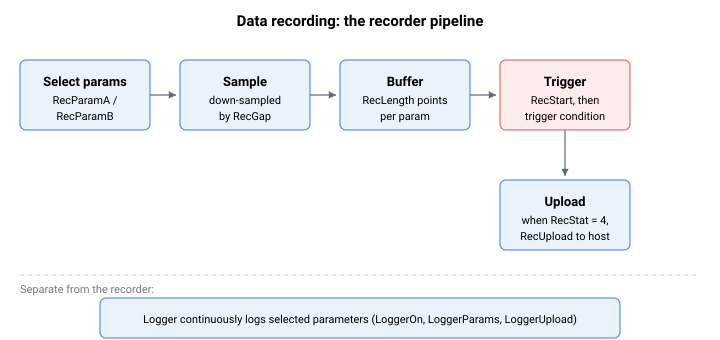
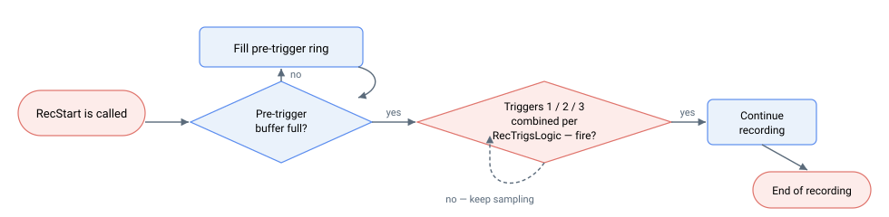
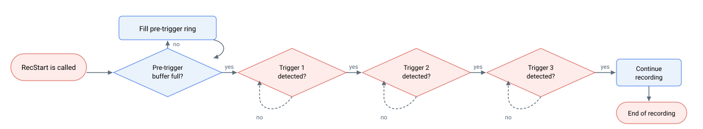

# 数据记录

数据记录功能允许用户记录任意一组参数的时间序列。记录的数据存储在控制器内部，随后可流式传输至上位机。



## 采集机制

本节包含三种独立的数据采集机制。它们均基于将一组参数采样至控制器缓冲区并流式传输至上位机的概念，但在采集启动方式和读取方式上有所不同：

- **触发式记录器 — `Rec*` 关键字。** 在一次采集过程中捕获固定长度、触发对齐的窗口，完成后上传。支持触发配置，部分产品支持两个独立的记录系统。这是下文详细说明的机制；其记录系统历史上称为"示波器 1 和 2"。
- **连续记录器 — `Logger*` 关键字**（参见 [LoggerOn](LoggerOn.md)）。在后台无触发地持续运行，采样最多 40 个参数，并在运行期间通过 [LoggerUpload](LoggerUpload.md) 增量读取。
- **Central-i 信号示波器 — `Scope*` 关键字**（参见 [ScopeOn](ScopeOn.md)，仅限 Central-i / v5）。持续流式传输最多六路信号用于实时监控，通过 [ScopeUpload](ScopeUpload.md) 增量读取；若缓冲区在被读取前填满则暂停。

当需要精确的、触发对齐的快照时，使用触发式记录器；当需要在开放时间段内监控信号时，使用连续记录器或 Central-i 示波器。本概述其余部分介绍触发式记录器（`Rec*`）。

根据产品不同，示波器数量和每个示波器的最大数据点数有所不同。下表汇总了各产品的记录能力。

| 属性 | 限制 |
|---|---|
| 记录系统数量（示波器编号） | 2（适用于 AGD301 和 AGM800）1（适用于所有其他独立产品） |
| 每个示波器的最大总数据点数 | 30500（适用于 AGD301）500 万（适用于 AGM800）16500（适用于所有其他独立产品） |
| 每个示波器的最大参数总数 | 20 |
| 最低采样率 | 16.384kHz（典型值） |

当存在多个示波器时，各示波器彼此独立运行。每个示波器将拥有各自针对数组相关变量的专属关键字。对于单示波器产品，不存在的第二个示波器的数组相关关键字将指向第一个示波器的对应关键字。

| 示波器编号 | 数组相关关键字 |
|-----------|------------------------|
| 1         | RecDataA, RecParamA    |
| 2         | RecDataB, RecParamB    |

设置示波器的通用流程如下。

1.  通过 [RecStop](RecStop.md) 命令停止任何正在进行的记录过程。

2.  用户将参数的复合 CAN 代码写入 [RecParamA](RecParamA-RecParamB.md) 或 [RecParamB](RecParamA-RecParamB.md) 数组，以选择要记录的参数。

3.  通过选择降采样因子（[RecGap](RecGap.md)）配置记录速率。

4.  通过写入每个参数的数据点数量（[RecLength](RecLength.md)）配置记录时长。

5.  配置触发检测模式（[RecTrigsMode](RecTrigsMode.md)）。

    1.  并行（逻辑）触发检测

> 
>
> 连接触发条件的逻辑关系可通过 [RecTrigsLogic](RecTrigsLogic.md) 配置。

2.  串行触发检测

> 

6.  对于每个触发，通过 [RecTrigTyp](RecTrigTyp.md) 选择触发类型（例如上升沿、大于等）。对于单触发应用，必须配置 RecTrigsMode、RecTrigsLogic 和 RecTrigTyp 以忽略第二和第三触发。PCSuite 支持此类配置。

7.  根据所选触发类型，需要为每个触发配置附加设置（[RecTrigMask](RecTrigMask.md)、[RecTrigPos](RecTrigPos.md)、[RecTrigSrc](RecTrigSrc.md)、[RecTrigVal](RecTrigVal.md)、[RecTrigValMax](RecTrigValMax.md)）。

8.  通过 [RecStart](RecStart.md) 命令启动数据记录，其进度取决于触发条件。如有需要，用户可通过 [RecTrigForce](RecTrigForce.md) 命令强制触发。

9.  用户查询 [RecStat](RecStat.md) 以获取记录状态。也可随时使用 RecStop 命令停止记录过程。

10. 记录完成后（RecStat = 4），用户可通过 [RecUpload](RecUpload.md) 命令将数据流式传输至上位机。

11. 如需元数据和原始记录数据（不含单位换算），用户可查询 [RecDataA](RecDataA-RecDataB.md) 或 [RecDataB](RecDataA-RecDataB.md)。可查询的数组条目受最大索引限制。

**注意：**

1. 对于 32 位整型数据类型的参数，数据将被转换为 64 位长整型数据类型并存储。
2. 对于 32 位浮点数据类型的参数，数据将被转换为 64 位双精度浮点类型，再以类型双关方式转换为 64 位长整型后存储。
3. 对于 64 位长整型数据类型的参数，数据正常存储。
4. 对于 64 位双精度浮点数据类型的参数，数据以类型双关方式转换为 64 位长整型后存储。

**连续记录：** 参见 [RecCTEnable](RecCTEnable.md) 和 [RecCTMaxSize](RecCTMaxSize.md)。

## 操作演练：捕获到位稳定事件

为诊断轴在运动后如何到位稳定，将示波器 1 设置为在速度（[Vel](../10-motion/01-kinematics-status/Vel.md)，元素 `[1]`）触发信号触发前后捕获一个小窗口，然后将结果流式传输至上位机。

1. **停止任何之前正在运行的任务**，然后选择要记录的通道。每个条目均为[复合 CAN 代码](../../01-keyword-usage-and-syntax/complex-can-code.md)；用 `0` 结束列表：

   ```text
   ARecStop[1]                  ; 中止示波器 1 上之前的任何记录
   ARecParamA[1]=<complex CAN code of APosRef>
   ARecParamA[2]=<complex CAN code of APos>
   ARecParamA[3]=<complex CAN code of AVel[1]>
   ARecParamA[4]=0              ; 在索引 4 处终止列表
   ```

2. **设置时长（速率和长度）**，并选择缓冲区中应保留触发前采样的比例。`ARecGap[1]=1` 表示示波器每个控制器周期采集一次；在 16384 Hz 周期速率下 `ARecLength[1]=16384` 每通道覆盖约一秒；`ARecTrigPos[1]=20` 保留其中 20% 用于触发前数据：

   ```text
   ARecGap[1]=1                 ; 每个周期记录一次
   ARecLength[1]=16384          ; 每通道 16384 个采样点（在 16384 Hz 下约 1 秒）
   ARecTrigPos[1]=20            ; 保留 20% 用于触发前数据
   ```

3. **在示波器 1 的第一个插槽上配置单个触发。** 使用 `AVel[1]` 过零点的上升沿：

   ```text
   ARecTrigsMode[1]=1           ; 并行（逻辑）触发评估
   ARecTrigsLogic[1]=1
   ARecTrigsLogic[2]=1
   ARecTrigSrc[1]=<complex CAN code of AVel[1]>
   ARecTrigTyp[1]=5             ; RecTrigVal 的上升沿过零
   ARecTrigVal[1]=0             ; 阈值
   ARecTrigMask[1]=-1           ; 全掩码（比较所有位）
   ARecTrigTyp[2]=0             ; 禁用触发 2
   ARecTrigTyp[3]=0             ; 禁用触发 3
   ```

4. **启动示波器。** [RecStat](RecStat.md) 在触发前填充期间报告 `1`，等待触发时报告 `2`，触发条件满足后报告 `3`，触发后采集完成时报告 `4`：

   ```text
   ARecStart[1]                 ; 启动示波器 1
   ARecStat[1]                  ; 轮询直至读取到 4（完成）
   ```

   如果触发条件从未满足，可通过 `ARecTrigForce[1]` 强制触发，或通过 `ARecStop[1]` 中止（触发后状态为 `5`，触发前为 `6`）。

5. **上传。** 一旦 `ARecStat[1] = 4`，[RecUpload](RecUpload.md) 将按 `RecParamA` 设置的顺序流式传输元数据和用户单位缩放后的采样值。对于大型采集，使用 [RecUploadNext](RecUploadNext.md) 以可管理的数据包检索数据，或通过 [RecDataA](RecDataA-RecDataB.md) 读取原始未缩放缓冲区：

   ```text
   ARecUpload[1]                ; 将元数据和缩放采样值流式传输至上位机
   ```

双示波器产品可使用 `RecParamB`、`RecGap[2]`、`RecLength[2]`、触发索引 `[4..6]` 和 `ARecStart[2]` 集合，以相同模式独立运行示波器 2。若需无界流式传输而非一次性采集，参见 [RecCTEnable](RecCTEnable.md)（连续记录）和独立的 [LoggerOn](LoggerOn.md) 系列。
