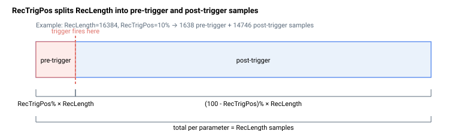

# RecTrigPos

触发前捕获的 RecLength 百分比（触发前数据）。

## 概述

`RecTrigPos` 定义在触发条件激活之前，从 [RecLength](RecLength.md) 中捕获的数据点百分比。通常在调试时使用，以便监测触发事件发生前的数据。每个数组索引对应一个示波器。有效值为 0 到 100；若值超出此范围，[RecStart](RecStart.md) 将拒绝请求并返回错误 71。



| 索引 | 说明 |
|-------|------------------------------|
| 1     | 第一示波器 |
| 2     | 第二示波器（如适用） |

## 示例

```text
ARecTrigPos[1]=10    ; reserve 10% of RecLength for pre-trigger data
ARecTrigPos[1]      ; query the first scope pre-trigger percentage
```

若 `RecLength[1] = 16384` 且 `RecTrigPos[1] = 10`，则第一示波器将有 1638 个触发前数据点和 14746 个触发后数据点。

## 另请参阅

- [RecLength](RecLength.md) — 每个参数的总数据点数
- [RecStat](RecStat.md) — 报告触发前数据何时填满
- [RecTrigTyp](RecTrigTyp.md) — 触发激活类型
