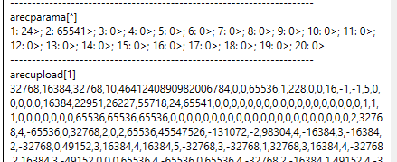

# RecUpload

**Definition:**

RecUpload will instruct the controller to stream/return all the metadata and user-unit scaled recorded data. Each RecUpload index refers to a different scope.

| Index | Descriptions                 |
|-------|------------------------------|
| 1     | First scope                  |
| 2     | Second scope (if applicable) |

RecUpload can only be run after the data recording is completed or stopped.

The data will be returned in comma delimited format for RS232 and Ethernet communication. In CAN, each value will be uploaded as 9-byte message (8 bytes for value, 1 byte for ASCII comma).

The first 80 values returned are the metadata. The subsequent values (81st value and above) are the recorded data, sequenced according to the RecParamA/RecParamB order, and followed by the data sample order.

**Example:**

In the example, APosRef and AVel\[1\] are recorded. After the first 80 metadata values, the recorded data can be extracted as shown.

| Sample no. | APosRef | AVel[1] |
|---|---|---|
| 1 | 2 | 32768 |
| 2 | 4 | -65536 |
| 3 | 0 | 32768 |
| 4 | 2 | 0 |
| 5 | 2 | 65536 |
| and so on… | and so on… | and so on… |
