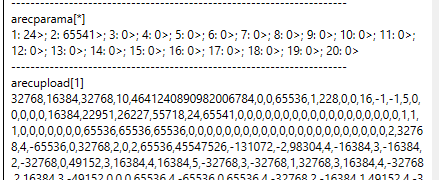

# RecUpload

将示波器的元数据及经用户单位缩放的记录数据流式传输至上位机。

## 概述

`RecUpload` 指示控制器流式传输某示波器的全部元数据及经用户单位缩放的记录数据。与 [RecDataA/RecDataB](RecDataA-RecDataB.md)（直接暴露原始未转换缓冲区）不同，`RecUpload` 会应用单位转换并返回完整数据集。每个数组索引对应不同的示波器。

| 索引 | 描述                   |
|-------|------------------------------|
| 1     | 第一示波器                   |
| 2     | 第二示波器（如适用）         |

`RecUpload` 只能在数据记录完成或停止后执行（参见 [RecStat](RecStat.md)）。

## 工作原理

通过 RS232 传输时，数据以逗号分隔的 ASCII 文本形式返回。通过以太网传输时，每个值以原始二进制值加 ASCII 逗号的形式发送；在 v4 中每个值为 4 字节宽（5 字节字段），在 v5 中为 8 字节宽（9 字节字段）。通过 CAN 传输时，两个版本均将每个值以 5 字节消息（4 字节数值加 1 字节 ASCII 逗号）上传。

返回的前 80 个值为元数据。后续值（第 81 个值及以上）为记录数据，按 [RecParamA/RecParamB](RecParamA-RecParamB.md) 的顺序排列，再按数据采样顺序排列。对于非常大的数据集，请使用 [RecUploadNext](RecUploadNext.md) 以可管理的数据包形式分批获取数据。

`RecUpload` 仅在记录完成后有效。若示波器仍在记录（状态 1、2 或 3）、自上电以来未进行任何记录（状态 0），或记录在触发器触发前已停止（状态 6，无有效触发数据），则返回错误。状态值请参阅 [RecStat](RecStat.md)。在触发记录中，捕获区域为循环缓冲区，因此上传时利用存储的起始/触发/结束索引，以真实的时间顺序读取采样，即使数据在缓冲区内发生环绕也能正确处理。

## 示例

在该示例中，记录了 APosRef 和 AVel\[1\]。前 80 个元数据值之后，可按如下所示提取记录数据。

| 采样编号 | APosRef | AVel[1] |
|---|---|---|
| 1 | 2 | 32768 |
| 2 | 4 | -65536 |
| 3 | 0 | 32768 |
| 4 | 2 | 0 |
| 5 | 2 | 65536 |
| 依此类推… | 依此类推… | 依此类推… |

## 另请参阅

- [RecUploadNext](RecUploadNext.md) — 用于大数据集的分包上传
- [RecDataA/RecDataB](RecDataA-RecDataB.md) — 原始未转换缓冲区
- [RecStat](RecStat.md) — 记录状态（须为已完成/已停止）
- [RecParamA/RecParamB](RecParamA-RecParamB.md) — 记录参数的顺序
