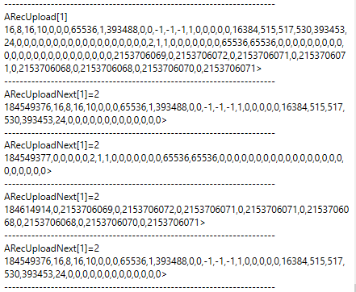

# RecUploadNext

Retrieves a scope's recorded data in successive fixed-size packets.

## Overview

`RecUploadNext` instructs the controller to return a data packet containing the next successive chunk of the metadata and user-unit scaled recorded data. It allows a large data set to be split into smaller, more manageable packets transmitted through repeated calls, which is the practical alternative to [RecUpload](RecUpload.md) when the recording is too large to stream in one transfer. Each array index refers to a different scope.

| Index | Descriptions                 |
|-------|------------------------------|
| 1     | First scope                  |
| 2     | Second scope (if applicable) |

## How it works

The `RecUploadNext` argument determines the instruction to the controller regarding the data packet.

| Argument | Instructions |
|----|----|
| 1 | Reset the data packet index to the first index (0). No data packet is returned. |
| 2 | Return the current data packet and increment the packet index (packet index rollovers to 0 if the current packet is the last packet). |

Each returned data packet stores 41 values, with each value being 8 bytes long (4 bytes long for older firmware). The first value of each packet is the packet header, while the remaining 40 values are the metadata and recorded data chunk.

The packet header stores the information in bit-field described below.

|  |  |  |  |  |
|----|:--:|:--:|:--:|:--:|
| Bit no. | 63…32 | 31…24 | 23…16 | 15…0 |
| Byte no. | 7…4 | 3 | 2 | 1…0 |
| Properties | Reserved | Number of recordings made by the controller since power up (reset to 0 upon power up) | Is the current packet the last packet? (0 – No, 1 – Yes) | Packet ID (0 to 65535) |

## Examples

In the example, only 8 data points per parameter (2 parameters in total) are captured in the first scope. Compared to RecUpload, RecUploadNext split the metadata and data into successive chunks.

The information from the packet headers is analysed as shown.

| Call no. | Header value | Number of recordings made by the controller since power up | Is the current packet the last packet? (0 – No, 1 – Yes) | Packet ID (0 to 65535) |
|----|----|----|----|----|
| 1 | 184549376 | 11 | 0 | 0 |
| 2 | 184549377 | 11 | 0 | 1 |
| 3 | 184614914 | 11 | 1 | 2 |
| 4 | 184549376 (repeat) | 11 | 0 | 0 |

It can be observed that the first call returns the first 40 entries of metadata, the second call returns the next 40 entries of metadata, and the third call returns the recorded data (16 datapoints in total).

## See also

- [RecUpload](RecUpload.md) — single-transfer upload
- [RecStat](RecStat.md) — recording status (must be completed/stopped)
- [RecParamA/RecParamB](RecParamA-RecParamB.md) — order of recorded parameters
