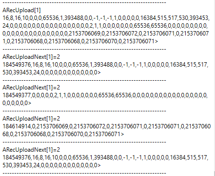

# RecUploadNext

以连续固定大小数据包的形式获取示波器记录数据。

## 概述

`RecUploadNext` 指示控制器返回包含元数据及经用户单位缩放的记录数据的下一个连续数据块的数据包。它允许将大数据集拆分为较小、更易管理的数据包，通过重复调用进行传输，是当记录数据量过大而无法一次性流式传输时替代 [RecUpload](RecUpload.md) 的实用方案。每个数组索引对应不同的示波器。

| 索引 | 描述                   |
|-------|------------------------------|
| 1     | 第一示波器                   |
| 2     | 第二示波器（如适用）         |

## 工作原理

`RecUploadNext` 的参数决定对控制器关于数据包的操作指令。

| 参数 | 指令 |
|----|----|
| 1 | 将数据包索引重置为第一个索引（0）。不返回任何数据包。 |
| 2 | 返回当前数据包并递增数据包索引（若当前数据包为最后一个数据包，则数据包索引回绕至 0）。 |

每个返回的数据包存储 41 个值，每个值为 8 字节长（旧版固件为 4 字节长）。每个数据包的第一个值为数据包头，其余 40 个值为元数据和记录数据块。

数据包头按以下位域格式存储信息。

|  |  |  |  |  |
|----|:--:|:--:|:--:|:--:|
| 位编号 | 63…32 | 31…24 | 23…16 | 15…0 |
| 字节编号 | 7…4 | 3 | 2 | 1…0 |
| 属性 | 保留 | 控制器自上电以来的记录次数（上电时重置为 0） | 当前数据包是否为最后一个数据包？（0 – 否，1 – 是） | 数据包 ID（0 至 65535） |

## 示例

在该示例中，第一示波器仅捕获每个参数（共 2 个参数）的 8 个数据点。与 RecUpload 相比，RecUploadNext 将元数据和数据拆分为连续的数据块。

从数据包头中提取的信息如下所示。

| 调用次数 | 包头值 | 控制器自上电以来的记录次数 | 当前数据包是否为最后一个数据包？（0 – 否，1 – 是） | 数据包 ID（0 至 65535） |
|----|----|----|----|----|
| 1 | 184549376 | 11 | 0 | 0 |
| 2 | 184549377 | 11 | 0 | 1 |
| 3 | 184614914 | 11 | 1 | 2 |
| 4 | 184549376（重复） | 11 | 0 | 0 |

可以观察到，第 1 次调用返回元数据的前 40 条，第 2 次调用返回元数据的后 40 条，第 3 次调用返回记录数据（共 16 个数据点）。

## 另请参阅

- [RecUpload](RecUpload.md) — 单次传输上传
- [RecStat](RecStat.md) — 记录状态（须为已完成/已停止）
- [RecParamA/RecParamB](RecParamA-RecParamB.md) — 记录参数的顺序
