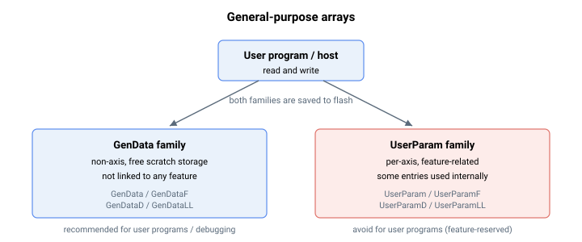

# 数组

多种数据类型的通用数组（GenData、GenDataD、GenDataF 和 GenDataLL）可供用户读写。通常情况下，这些数组不与控制器的任何功能关联，因此可用于：

1.  用户程序（作为程序变量）

2.  固件中的自定义用户函数（作为临时变量）

3.  调试用途

用户可通过常规写入操作直接设置值，也可通过间接写入函数间接设置。

相比之下，用户参数数组（UserParam、UserParamD、UserParamF、UserParamLL）为与功能关联的数组，其中部分数组条目用于存储临时变量。控制器在内部确保同一时刻每个条目最多被一个功能使用。例如，部分 UserParam 条目用于回零序列和 CNC 运动变量。因此，不建议在用户程序、自定义函数或调试中使用用户参数数组。
