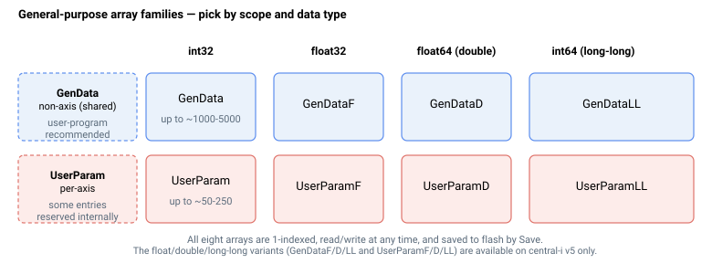

# GenData

通用非轴 32 位整数数组，用于用户/上位机共享存储。

## 概述

`GenData` 是一个通用 32 位有符号整数数组，提供用户程序和上位机均可访问的共享存储空间。它不与任何控制器功能关联，因此非常适合用作用户程序变量、自定义函数中的临时变量以及调试用途。该数组为非轴（整个控制器共享一个数组），可随时读写，并保存至闪存，因此在参数存储后内容可在重新上电后保留。

`GenData` 是通用数据系列中的 32 位整数成员：[GenDataF](GenDataF.md)（32 位浮点）、[GenDataD](GenDataD.md)（64 位双精度浮点）和 [GenDataLL](GenDataLL.md)（64 位有符号整数）提供相同类型的共享存储，适用于其他数据类型。对于控制器内部也用于某些功能的轴相关存储，请参阅 [UserParam](UserParam.md)。值可通过常规写入直接设置，也可通过下文描述的上位机间接写入机制设置。



每个元素存储一个 32 位有符号整数，因此值范围为 -2147483648 至 2147483647，默认值为 0。数组为 1 索引：第一个可用元素为 `GenData[1]`（索引 0 保留，不可访问）。可用元素数量取决于控制器型号：通常为 1000，较大型控制器为 5000，双闪存存储型号最多为 10000。

## 寻址

元素通常使用字面索引写入，例如 `AGenData[5]=100`。另有两种机制允许在运行时选择索引。

### 用户程序中的计算（运行时）索引

在用户程序中，使用索引 `[0]` 访问数组元素是请求*计算*索引：索引从当前线程的数值栈顶获取，而非来自指令本身。程序首先压入所需索引（例如通过 [Math](../17-user-program/02-program-execution/Math.md) 的运算结果），然后以索引 `[0]` 写入或读取元素。读取侧的说明见 [PushParam](../17-user-program/03-stack-operation/PushParam.md)。

控制器对弹出的索引执行以下检查：

- 若数值栈为空，指令将以错误 53 被拒绝。
- 弹出的值必须在 1 到最高可用索引的范围内；负值、0 或超出数组大小的值将以错误 20 被拒绝。

在用户程序之外（普通上位机写入），索引 `[0]` 不是计算索引请求——它只是一个越界索引，将以错误 20 被拒绝。

### 来自上位机的间接写入

上位机也可以在不直接寻址关键字的情况下写入元素，使用三寄存器间接写入机制：将 [IndirectArray](../../05-legacy-keywords/IndirectArray.md) 设置为目标数组，将 [IndirectIndex](../../05-legacy-keywords/IndirectIndex.md) 设置为元素索引，将 [IndirectValue](../../05-legacy-keywords/IndirectValue.md) 设置为值，然后触发 [IndirectDo](../../05-legacy-keywords/IndirectDo.md) 执行写入。

此路径只能目标 `GenData`。`IndirectArray` 接受单一值（1 = `GenData`）；选择任何其他数组将以错误 115 拒绝写入。索引必须在 1 到最高可用索引的范围内，否则写入将以错误 116 被拒绝。`IndirectValue` 为 32 位有符号整数（-2147483648 至 2147483647），因此间接写入路径只能写入 32 位整数值，无法目标系列中的浮点或 64 位成员（[GenDataF](GenDataF.md)、[GenDataD](GenDataD.md)、[GenDataLL](GenDataLL.md)）。

## 示例

```text
AGenData[1]=100      ; store 100 in the first element
AGenData[1]         ; read the first element
AGenData[1000]=0     ; highest usable index on a 1000-element model
```

## 另请参阅

- [GenDataD](GenDataD.md) — 64 位双精度浮点变体
- [GenDataF](GenDataF.md) — 32 位单精度浮点变体
- [GenDataLL](GenDataLL.md) — long-long（64 位有符号整数）变体
- [UserParam](UserParam.md) — 轴相关功能通用存储
