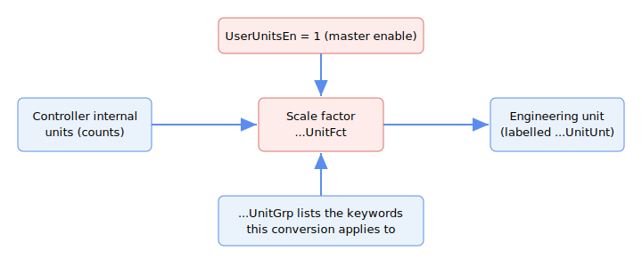

# Engineering Units

This category groups the keywords of the global engineering-units subsystem. They let a host application present and accept a set of related keyword values in a chosen engineering unit (for example mm, deg/s, or N) instead of the controller's internal units, without changing how the control loop itself runs.

The feature is available from central-i v5 only.

## The Group / Factor / Unit model

Each physical quantity has its own triplet of keywords. For a quantity *Q* (Position, Velocity, Acceleration, Force, and the auxiliary-encoder and pulse-and-direction variants of Position and Velocity):

- **`Q`UnitGrp** — a read-only array that lists which keywords belong to that quantity's unit group. These are the keywords whose values are reinterpreted together when the engineering unit is changed. The list is fixed by the firmware; you read it to see exactly which keywords a unit change affects.
- **`Q`UnitFct** — a floating-point scale factor between the controller's internal units for that quantity and the selected engineering unit. One factor applies to the whole group.
- **`Q`UnitUnt** — the display label (name) of the engineering unit for that quantity, stored as a short text string (up to 10 characters). It is a free-text label such as `mm` or `deg/s`; it documents the unit but does not by itself perform any conversion.

`UserUnitsEn` is the master enable for the whole subsystem on an axis. The triplets are:

| Quantity | Group | Factor | Unit label |
|---|---|---|---|
| Position | [PosUnitGrp](PosUnitGrp.md) | [PosUnitFct](PosUnitFct.md) | [PosUnitUnt](PosUnitUnt.md) |
| Velocity | [VelUnitGrp](VelUnitGrp.md) | [VelUnitFct](VelUnitFct.md) | [VelUnitUnt](VelUnitUnt.md) |
| Acceleration | [AccUnitGrp](AccUnitGrp.md) | [AccUnitFct](AccUnitFct.md) | [AccUnitUnt](AccUnitUnt.md) |
| Force | [FrcUnitGrp](FrcUnitGrp.md) | [FrcUnitFct](FrcUnitFct.md) | [FrcUnitUnt](FrcUnitUnt.md) |
| Auxiliary Position | [PosAuxUnitGrp](PosAuxUnitGrp.md) | [PosAuxUnitFct](PosAuxUnitFct.md) | [PosAuxUnitUnt](PosAuxUnitUnt.md) |
| Auxiliary Velocity | [VelAuxUnitGrp](VelAuxUnitGrp.md) | [VelAuxUnitFct](VelAuxUnitFct.md) | [VelAuxUnitUnt](VelAuxUnitUnt.md) |
| P/D Position | [PosPDUnitGrp](PosPDUnitGrp.md) | [PosPDUnitFct](PosPDUnitFct.md) | [PosPDUnitUnt](PosPDUnitUnt.md) |
| P/D Velocity | [VelPDUnitGrp](VelPDUnitGrp.md) | [VelPDUnitFct](VelPDUnitFct.md) | [VelPDUnitUnt](VelPDUnitUnt.md) |

The auxiliary-encoder (Aux) and pulse-and-direction (P/D) variants exist for Position and Velocity only — there is no acceleration or force Aux/PD variant. The Aux variants apply to the auxiliary feedback keywords (`AuxPos`, `AuxVel`) and the P/D variants apply to the pulse-and-direction keywords (`PDPos`, `PDVel`). Their embedded-scaling conflict is against `AuxUsrUnits` (for the Aux variants) and `PDUsrUnits` (for the P/D variants), rather than against `UsrUnits`.

## Relationship to the embedded UsrUnits scaling

This global engineering-units feature is separate from the existing per-axis [UsrUnits](../03-encoder/01-general-settings/UsrUnits-AuxUsrUnits.md) (and `AuxUsrUnits`) scaling. The two methods are **mutually exclusive on a given axis**: if `UserUnitsEn` is active for an axis while the matching embedded scaling is also set to a non-default value on that axis, then reading or writing a keyword that belongs to the affected global unit group is rejected with error code `338` ("Global User Units feature is mutually exclusive with embedded controller user units"). The conflict applies to the position, velocity, and acceleration keywords (against [UsrUnits](../03-encoder/01-general-settings/UsrUnits-AuxUsrUnits.md)), the auxiliary keywords (against `AuxUsrUnits`), and the pulse-and-direction keywords (against `PDUsrUnits`). The force unit group, although it has its own factor and label keywords, is not subject to this embedded-scaling conflict and never raises error `338`. Disable one of the two scaling methods to clear the conflict. See [UserUnitsEn](UserUnitsEn.md) for details.

## Keywords

| Keyword | Summary |
|---|---|
| [UserUnitsEn](UserUnitsEn.md) | Master enable for the global engineering-units feature on an axis. |
| [PosUnitGrp](PosUnitGrp.md) | Lists the keywords in the position unit group. |
| [PosUnitFct](PosUnitFct.md) | Scale factor between internal position units and the selected engineering unit. |
| [PosUnitUnt](PosUnitUnt.md) | Display label for the position engineering unit. |
| [VelUnitGrp](VelUnitGrp.md) | Lists the keywords in the velocity unit group. |
| [VelUnitFct](VelUnitFct.md) | Scale factor between internal velocity units and the selected engineering unit. |
| [VelUnitUnt](VelUnitUnt.md) | Display label for the velocity engineering unit. |
| [AccUnitGrp](AccUnitGrp.md) | Lists the keywords in the acceleration unit group. |
| [AccUnitFct](AccUnitFct.md) | Scale factor between internal acceleration units and the selected engineering unit. |
| [AccUnitUnt](AccUnitUnt.md) | Display label for the acceleration engineering unit. |
| [FrcUnitGrp](FrcUnitGrp.md) | Lists the keywords in the force unit group. |
| [FrcUnitFct](FrcUnitFct.md) | Scale factor between internal force units and the selected engineering unit. |
| [FrcUnitUnt](FrcUnitUnt.md) | Display label for the force engineering unit. |
| [PosAuxUnitGrp](PosAuxUnitGrp.md) | Lists the keywords in the auxiliary-encoder position unit group. |
| [PosAuxUnitFct](PosAuxUnitFct.md) | Scale factor between internal auxiliary position units and the selected engineering unit. |
| [PosAuxUnitUnt](PosAuxUnitUnt.md) | Display label for the auxiliary position engineering unit. |
| [VelAuxUnitGrp](VelAuxUnitGrp.md) | Lists the keywords in the auxiliary-encoder velocity unit group. |
| [VelAuxUnitFct](VelAuxUnitFct.md) | Scale factor between internal auxiliary velocity units and the selected engineering unit. |
| [VelAuxUnitUnt](VelAuxUnitUnt.md) | Display label for the auxiliary velocity engineering unit. |
| [PosPDUnitGrp](PosPDUnitGrp.md) | Lists the keywords in the pulse-and-direction position unit group. |
| [PosPDUnitFct](PosPDUnitFct.md) | Scale factor between internal pulse-and-direction position units and the selected engineering unit. |
| [PosPDUnitUnt](PosPDUnitUnt.md) | Display label for the pulse-and-direction position engineering unit. |
| [VelPDUnitGrp](VelPDUnitGrp.md) | Lists the keywords in the pulse-and-direction velocity unit group. |
| [VelPDUnitFct](VelPDUnitFct.md) | Scale factor between internal pulse-and-direction velocity units and the selected engineering unit. |
| [VelPDUnitUnt](VelPDUnitUnt.md) | Display label for the pulse-and-direction velocity engineering unit. |
