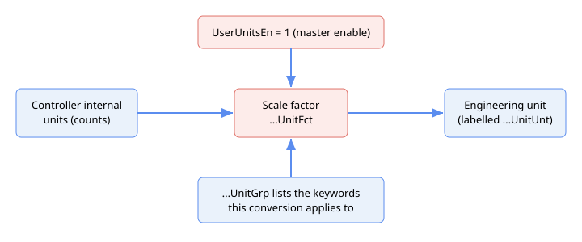

# 工程单位

本类别汇集了全局工程单位子系统的相关关键字。该子系统允许上位机应用程序以所选工程单位（例如 mm、deg/s 或 N）呈现和接受一组相关关键字的值，而无需更改控制环本身的运行方式。

该功能仅在 central-i v5 中可用。

## 组 / 因子 / 单位模型

每个物理量拥有各自的三元关键字组。对于物理量 *Q*（位置、速度、加速度、力，以及辅助编码器和脉冲/方向的位置与速度变体）：

- **`Q`UnitGrp** — 只读数组，列出属于该物理量单位组的关键字。当工程单位发生变化时，这些关键字的值将被统一重新解释。列表由固件固定；读取该关键字可以确认某次单位变更具体影响哪些关键字。
- **`Q`UnitFct** — 浮点缩放因子，介于控制器该物理量的内部单位与所选工程单位之间。一个因子适用于整个组。
- **`Q`UnitUnt** — 该物理量工程单位的显示标签（名称），以短文本字符串（最多 10 个字符）存储。这是一个自由文本标签，例如 `mm` 或 `deg/s`；它记录单位，但本身不执行任何转换。

`UserUnitsEn` 是某轴上整个子系统的主使能开关。三元组如下：

| 物理量 | 组 | 因子 | 单位标签 |
|---|---|---|---|
| 位置 | [PosUnitGrp](PosUnitGrp.md) | [PosUnitFct](PosUnitFct.md) | [PosUnitUnt](PosUnitUnt.md) |
| 速度 | [VelUnitGrp](VelUnitGrp.md) | [VelUnitFct](VelUnitFct.md) | [VelUnitUnt](VelUnitUnt.md) |
| 加速度 | [AccUnitGrp](AccUnitGrp.md) | [AccUnitFct](AccUnitFct.md) | [AccUnitUnt](AccUnitUnt.md) |
| 力 | [FrcUnitGrp](FrcUnitGrp.md) | [FrcUnitFct](FrcUnitFct.md) | [FrcUnitUnt](FrcUnitUnt.md) |
| 辅助位置 | [PosAuxUnitGrp](PosAuxUnitGrp.md) | [PosAuxUnitFct](PosAuxUnitFct.md) | [PosAuxUnitUnt](PosAuxUnitUnt.md) |
| 辅助速度 | [VelAuxUnitGrp](VelAuxUnitGrp.md) | [VelAuxUnitFct](VelAuxUnitFct.md) | [VelAuxUnitUnt](VelAuxUnitUnt.md) |
| P/D 位置 | [PosPDUnitGrp](PosPDUnitGrp.md) | [PosPDUnitFct](PosPDUnitFct.md) | [PosPDUnitUnt](PosPDUnitUnt.md) |
| P/D 速度 | [VelPDUnitGrp](VelPDUnitGrp.md) | [VelPDUnitFct](VelPDUnitFct.md) | [VelPDUnitUnt](VelPDUnitUnt.md) |

辅助编码器（Aux）和脉冲/方向（P/D）变体仅适用于位置和速度——不存在加速度或力的 Aux/PD 变体。Aux 变体适用于辅助反馈关键字（`AuxPos`、`AuxVel`），P/D 变体适用于脉冲/方向关键字（`PDPos`、`PDVel`）。其内嵌缩放冲突针对 `AuxUsrUnits`（Aux 变体）和 `PDUsrUnits`（P/D 变体），而非 `UsrUnits`。

## 与内嵌 UsrUnits 缩放的关系

该全局工程单位功能独立于现有的每轴 [UsrUnits](../03-encoder/01-general-settings/UsrUnits-AuxUsrUnits.md)（及 `AuxUsrUnits`）缩放。两种方法在同一轴上**互斥**：如果某轴上 `UserUnitsEn` 已激活，同时该轴上匹配的内嵌缩放也设置为非默认值，则读取或写入属于受影响全局单位组的关键字时，将以错误码 `338`（"Global User Units feature is mutually exclusive with embedded controller user units"）拒绝操作。冲突范围包括位置、速度和加速度关键字（与 [UsrUnits](../03-encoder/01-general-settings/UsrUnits-AuxUsrUnits.md) 冲突）、辅助关键字（与 `AuxUsrUnits` 冲突）以及脉冲/方向关键字（与 `PDUsrUnits` 冲突）。力单位组虽有自己的因子和标签关键字，但不受此内嵌缩放冲突的约束，永远不会触发错误 `338`。禁用其中一种缩放方法即可消除冲突。详见 [UserUnitsEn](UserUnitsEn.md)。

## 关键字

| 关键字 | 说明 |
|---|---|
| [UserUnitsEn](UserUnitsEn.md) | 某轴上全局工程单位功能的主使能。 |
| [PosUnitGrp](PosUnitGrp.md) | 列出位置单位组中的关键字。 |
| [PosUnitFct](PosUnitFct.md) | 内部位置单位与所选工程单位之间的缩放因子。 |
| [PosUnitUnt](PosUnitUnt.md) | 位置工程单位的显示标签。 |
| [VelUnitGrp](VelUnitGrp.md) | 列出速度单位组中的关键字。 |
| [VelUnitFct](VelUnitFct.md) | 内部速度单位与所选工程单位之间的缩放因子。 |
| [VelUnitUnt](VelUnitUnt.md) | 速度工程单位的显示标签。 |
| [AccUnitGrp](AccUnitGrp.md) | 列出加速度单位组中的关键字。 |
| [AccUnitFct](AccUnitFct.md) | 内部加速度单位与所选工程单位之间的缩放因子。 |
| [AccUnitUnt](AccUnitUnt.md) | 加速度工程单位的显示标签。 |
| [FrcUnitGrp](FrcUnitGrp.md) | 列出力单位组中的关键字。 |
| [FrcUnitFct](FrcUnitFct.md) | 内部力单位与所选工程单位之间的缩放因子。 |
| [FrcUnitUnt](FrcUnitUnt.md) | 力工程单位的显示标签。 |
| [PosAuxUnitGrp](PosAuxUnitGrp.md) | 列出辅助编码器位置单位组中的关键字。 |
| [PosAuxUnitFct](PosAuxUnitFct.md) | 内部辅助位置单位与所选工程单位之间的缩放因子。 |
| [PosAuxUnitUnt](PosAuxUnitUnt.md) | 辅助位置工程单位的显示标签。 |
| [VelAuxUnitGrp](VelAuxUnitGrp.md) | 列出辅助编码器速度单位组中的关键字。 |
| [VelAuxUnitFct](VelAuxUnitFct.md) | 内部辅助速度单位与所选工程单位之间的缩放因子。 |
| [VelAuxUnitUnt](VelAuxUnitUnt.md) | 辅助速度工程单位的显示标签。 |
| [PosPDUnitGrp](PosPDUnitGrp.md) | 列出脉冲/方向位置单位组中的关键字。 |
| [PosPDUnitFct](PosPDUnitFct.md) | 内部脉冲/方向位置单位与所选工程单位之间的缩放因子。 |
| [PosPDUnitUnt](PosPDUnitUnt.md) | 脉冲/方向位置工程单位的显示标签。 |
| [VelPDUnitGrp](VelPDUnitGrp.md) | 列出脉冲/方向速度单位组中的关键字。 |
| [VelPDUnitFct](VelPDUnitFct.md) | 内部脉冲/方向速度单位与所选工程单位之间的缩放因子。 |
| [VelPDUnitUnt](VelPDUnitUnt.md) | 脉冲/方向速度工程单位的显示标签。 |
